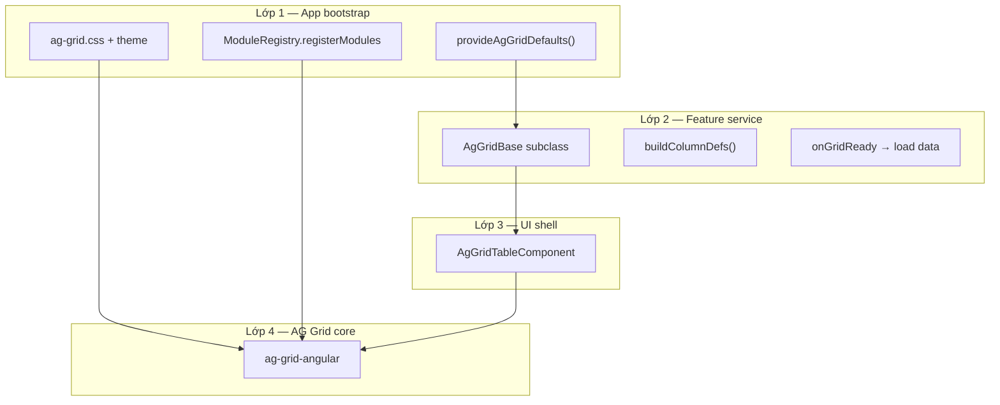
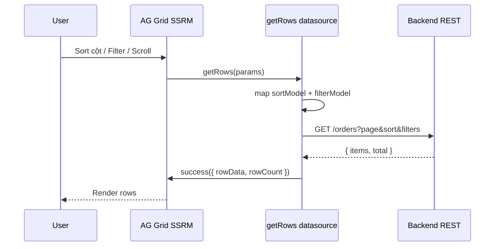

# Bài giảng Master: AG Grid trong Angular

> **Đối tượng:** Dev Angular chưa biết hoặc mới dùng AG Grid  
> **Mục tiêu cuối:** Thiết kế và vận hành bảng phức tạp trong production — biết **config nào**, **field nào**, **để làm gì**, **tại sao cần**, **dùng khi nào**  
> **Stack:** AG Grid v35 · Angular 20 · `@app/ag-grid-common` (repo này)

---

## Cách đọc bài giảng này

Mỗi thuộc tính/config được trình bày theo **5 câu hỏi master**:

| Câu hỏi | Ý nghĩa |
|---------|---------|
| **Là gì / Để làm gì?** | Thuộc tính đó điều khiển hành vi nào của grid |
| **Tại sao cần?** | Vấn đề thực tế nó giải quyết — không học vẹt |
| **Dùng khi nào?** | Tình huống cụ thể nên bật/tắt |
| **Không dùng khi nào?** | Anti-pattern — tránh lãng phí debug |
| **Ví dụ & liên kết** | Code + thuộc tính liên quan |

**Ký hiệu:**

- 🟢 **Nên dùng** — pattern production
- 🟡 **Tùy case** — cân nhắc trade-off
- 🔴 **Tránh** — hay gây bug hoặc nợ kỹ thuật

---

## Mục lục

**Phần I — Tư duy nền**
- [Bài 1: AG Grid không phải `<table>`](#bài-1-ag-grid-không-phải-table)
- [Bài 2: Mô hình 4 lớp trong Angular](#bài-2-mô-hình-4-lớp-trong-angular)

**Phần II — Setup**
- [Bài 3: Cài đặt từng bước và lý do](#bài-3-cài-đặt-từng-bước-và-lý-do)

**Phần III — GridOptions (toàn grid)**
- [Bài 4: Dữ liệu & row model](#bài-4-dữ-liệu--row-model)
- [Bài 5: Cột mặc định & layout](#bài-5-cột-mặc-định--layout)
- [Bài 6: Pagination & selection](#bài-6-pagination--selection)
- [Bài 7: Callback lifecycle](#bài-7-callback-lifecycle)
- [Bài 8: Context, components, getRowId](#bài-8-context-components-getrowid)

**Phần IV — ColDef (từng cột)**
- [Bài 9: Nhận diện cột — field, colId, headerName](#bài-9-nhận-diện-cột)
- [Bài 10: Kích thước — width, flex, pinned](#bài-10-kích-thước-cột)
- [Bài 11: Sort & filter sâu](#bài-11-sort--filter-sâu)
- [Bài 12: Value pipeline — cài đặt & thời điểm chạy](#bài-12-value-pipeline--cài-đặt--thời-điểm-chạy)
- [Bài 13: Renderer & Editor](#bài-13-renderer--editor)
- [Bài 14: Cột đặc biệt — checkbox, actions, ẩn cột](#bài-14-cột-đặc-biệt)

**Phần V — GridApi**
- [Bài 15: Imperative API sau gridReady](#bài-15-gridapi)

**Phần VI — Server-side**
- [Bài 16: Server-side row model từ A→Z](#bài-16-server-side-row-model)

**Phần VII — Angular integration**
- [Bài 17: ag-grid-angular & change detection](#bài-17-ag-grid-angular)
- [Bài 18: Angular component trong cell](#bài-18-angular-component-trong-cell)

**Phần VIII — Production architecture**
- [Bài 19: AgGridBase — mọi config trong repo](#bài-19-aggridbase)
- [Bài 20: Case study end-to-end](#bài-20-case-study)

**Phần IX — Đi sâu master**
- [Bài 21: Cell Editor — từng loại, pipeline edit, validation](#bài-21-cell-editor--từng-loại-pipeline-edit-validation)
- [Bài 22: SSRM — map sortModel & filterModel sang backend API](#bài-22-ssrm--map-sortmodel--filtermodel-sang-backend-api)
- [Bài 23: Master / Detail & nested data — Community vs Enterprise](#bài-23-master--detail--nested-data--community-vs-enterprise)
- [Bài 24: Quick filter, floating filter & kết hợp SSRM](#bài-24-quick-filter-floating-filter--kết-hợp-ssrm)
- [Bài 25: Export, clipboard, column state & persist UX](#bài-25-export-clipboard-column-state--persist-ux)

**Phụ lục**
- [A: Bảng tra cứu nhanh GridOptions](#phụ-lục-a-gridoptions)
- [B: Bảng tra cứu nhanh ColDef](#phụ-lục-b-coldef)
- [C: Lộ trình luyện tập](#phụ-lục-c-luyện-tập)
- [D: Debug playbook](#phụ-lục-d-debug)
- [E: Bảng Cell Editor built-in](#phụ-lục-e-cell-editor-built-in)
- [F: Bảng map filterModel → SQL/OData](#phụ-lục-f-map-filtermodel--sqlodata)
- [H: Timeline — method nào chạy khi nào](#phụ-lục-h-timeline--method-nào-chạy-khi-nào)

---

# Phần I — Tư duy nền

## Bài 1: AG Grid không phải `<table>`

### 1.1 Vấn đề của `<table>` thuần

Khi product yêu cầu:

- Sort nhiều cột
- Filter theo kiểu dữ liệu
- Chọn 50 dòng rồi bulk delete
- 10.000 dòng vẫn scroll mượt
- Export CSV
- Cột Actions có nút, badge trạng thái

… bạn sẽ viết **hàng nghìn dòng** logic DOM, hoặc dùng thư viện chuyên dụng.

**AG Grid** là engine render bảng với **virtualisation**: chỉ vẽ các hàng/cột đang visible trên viewport. Đó là lý do nó scale được — không phải vì nó "nhanh hơn vòng lặp `*ngFor`" đơn thuần.

### 1.2 Hai "ngôn ngữ" cấu hình AG Grid

Master phải phân biệt rõ:

```
┌──────────────────────────────────────────────────────────┐
│  DECLARATIVE (khai báo)                                   │
│  GridOptions + ColDef — mô tả grid "trông như thế nào"   │
│  Ví dụ: columnDefs, defaultColDef, pagination              │
└──────────────────────────────────────────────────────────┘
                          +
┌──────────────────────────────────────────────────────────┐
│  IMPERATIVE (mệnh lệnh)                                   │
│  GridApi — ra lệnh sau khi grid đã khở tạo                 │
│  Ví dụ: setRowData, exportCsv, refreshServerSide          │
└──────────────────────────────────────────────────────────┘
```

**Quy tắc sống còn:** Config declarative trả lời *"grid được thiết kế thế nào"*. GridApi trả lời *"làm gì đó ngay bây giờ"*. Gọi GridApi **trước** `onGridReady` → lỗi hoặc no-op.

### 1.3 Community vs Enterprise

| | Community | Enterprise |
|---|-----------|------------|
| **Giá** | Miễn phí | Trả phí |
| **Đủ cho** | CRUD list, filter, sort, export CSV | Pivot, Excel export nâng cao, master/detail native, row grouping nâng cao |
| **Repo này** | ✅ Dùng Community | — |

🟢 **Master advice:** Bắt đầu Community. Chỉ mua Enterprise khi có **yêu cầu cụ thể** mà Community không làm được (pivot, grouped rows phức tạp…).

---

## Bài 2: Mô hình 4 lớp trong Angular

Trước khi đụng config, hãy nhìn **luồng dữ liệu** trong app Angular + repo này:



**Tại sao 4 lớp?**

- **Lớp 1:** Cấu hình **một lần** — theme, module, defaultColDef toàn app. Tránh mỗi màn copy lại.
- **Lớp 2:** Mỗi bảng = một **service** — cột + API + business logic. Test được, inject được.
- **Lớp 3:** Template page **luôn giống nhau** — `<app-ag-grid-table [grid]="...">`. Page không biết Users hay Orders.
- **Lớp 4:** AG Grid render — bạn **không** gọi trực tiếp từ page trong production.

🟢 **Dùng khi nào:** App có ≥ 2 màn hình bảng.  
🟡 **Chưa cần AgGridBase:** Prototype 1 màn, spike POC — dùng `ag-grid-angular` trực tiếp cho nhanh.

---

# Phần II — Setup

## Bài 3: Cài đặt từng bước và lý do

### 3.1 `npm install ag-grid-community ag-grid-angular`

| Package | Để làm gì | Tại sao cần |
|---------|-----------|-------------|
| `ag-grid-community` | Core engine + types + CSS | Logic grid, không phụ thuộc framework |
| `ag-grid-angular` | Wrapper `<ag-grid-angular>` | Bridge AG Grid ↔ Angular change detection |

🔴 **Không cài** chỉ `ag-grid-angular` mà thiếu `ag-grid-community` — peer dependency sẽ fail.

---

### 3.2 Import CSS

```scss
@use 'ag-grid-community/styles/ag-grid.css';
@use 'ag-grid-community/styles/ag-theme-quartz.css';
```

#### `ag-grid.css`

- **Là gì:** CSS **bắt buộc** — layout nội bộ grid (header, body, scroll container).
- **Tại sao cần:** Không có → grid render DOM nhưng **không có kích thước, không scroll, header vỡ**.
- **Dùng khi nào:** Luôn luôn, mọi project.

#### `ag-theme-quartz.css` (hoặc theme khác)

- **Là gì:** Skin giao diện — màu, font, border, hover.
- **Tại sao cần:** `ag-grid.css` chỉ có cấu trúc; theme mới có "đẹp".
- **Dùng khi nào:** Luôn — chọn một theme và gắn class tương ứng lên container.

**Theme phổ biến:**

| Class | Đặc điểm | Dùng khi |
|-------|----------|----------|
| `ag-theme-quartz` | Hiện đại, sáng, mặc định mới | App SaaS, admin dashboard |
| `ag-theme-quartz-dark` | Dark mode | App dark-first |
| `ag-theme-alpine` | Gọn, classic | Legacy app đã dùng Alpine |
| `ag-theme-balham` | Compact | Cần hiển thị nhiều dòng trên màn hình |

🟢 **Pattern container:**

```html
<div class="ag-theme-quartz" style="height: 400px; width: 100%;">
  <ag-grid-angular ... />
</div>
```

#### Tại sao **bắt buộc** set `height`?

- **Là gì:** Grid dùng **absolute positioning + virtual scroll** bên trong container có chiều cao cố định.
- **Tại sao cần:** Container `height: auto` → chiều cao tính = 0 hoặc collapse → **grid trống** (bug #1 của người mới).
- **Dùng khi nào:**
  - `height: 400px` — bảng trong card có chiều cao cố định
  - `height: calc(100vh - 200px)` — full màn hình trừ header
  - `height: 100%` — **chỉ khi** parent chain đều có height xác định

🔴 **Không dùng** `height: 100%` khi parent không có height — grid vẫn trống.

---

### 3.3 `ModuleRegistry.registerModules([AllCommunityModule])`

**Phiên bản v33+** AG Grid chuyển sang **module system** — chỉ bundle code bạn đăng ký.

| Khái niệm | Giải thích |
|-----------|------------|
| **Là gì** | Gọi một lần khi app bootstrap để đăng ký feature modules |
| **Tại sao cần** | Không register → runtime error *"module X not registered"* khi dùng filter, CSV export… |
| **Dùng khi nào** | `app.config.ts` hoặc `main.ts`, **trước** khi render grid đầu tiên |
| **AllCommunityModule** | Gói tất cả module Community — 🟢 dùng cho hầu hết app |

```typescript
import { AllCommunityModule, ModuleRegistry } from 'ag-grid-community';

ModuleRegistry.registerModules([AllCommunityModule]);
```

🟡 **Tối ưu bundle:** Production lớn có thể register từng module (`ClientSideRowModelModule`, `CsvExportModule`…) thay vì `AllCommunityModule`. Chỉ làm khi bundle size là vấn đề đo được.

---

### 3.4 Grid đầu tiên — giải thích từng input

```typescript
@Component({
  template: `
    <div class="ag-theme-quartz" style="height: 400px;">
      <ag-grid-angular
        [rowData]="rowData"
        [columnDefs]="columnDefs"
      />
    </div>
  `,
})
export class HelloGridComponent {
  columnDefs = [{ field: 'name' }, { field: 'age' }];
  rowData = [{ name: 'An', age: 25 }];
}
```

#### `[rowData]`

- **Là gì:** Mảng object — **mỗi object = một dòng**.
- **Tại sao cần:** Client-side row model (mặc định) lấy data từ đây.
- **Dùng khi nào:** Toàn bộ data đã có trên client (< ~5k dòng hoặc có pagination client).
- **Không dùng khi:** Server-side model — data đến qua `serverSideDatasource`, không set `rowData` ban đầu.

#### `[columnDefs]`

- **Là gì:** Mảng `ColDef` — định nghĩa **schema cột**.
- **Tại sao cần:** Grid không tự đoán cột từ data (trừ khi bạn code auto-generate).
- **Dùng khi nào:** Luôn — production luôn khai báo explicit columns (type-safe, control UX).

#### `[gridOptions]` vs input rời

| Cách | Ưu | Nhược | Dùng khi |
|------|-----|-------|----------|
| Input rời `[rowData]`, `[columnDefs]` | Dễ đọc tutorial | Khó merge config nhiều tầng | Demo, spike |
| `[gridOptions]="opts"` | Một object, merge dễ, pattern AgGridBase | Ít "Angular-ish" hơn | **Production** |

🟢 Repo này dùng `[gridOptions]` qua `AgGridTableComponent`.

---

# Phần III — GridOptions

`GridOptions` là **hợp đồng** giữa bạn và AG Grid: mô tả toàn bộ hành vi grid.

---

## Bài 4: Dữ liệu & row model

### 4.1 `rowData`

| | |
|---|---|
| **Là gì** | `TData[]` — nguồn dữ liệu client-side |
| **Tại sao cần** | Grid cần biết "có những dòng nào" để virtualise và render |
| **Dùng khi nào** | Client-side model; load xong API gán một lần hoặc cập nhật |
| **Không dùng khi** | Server-side / infinite model |

**Cập nhật data — 3 cách master cần biết:**

```typescript
// 1. Thay toàn bộ — đơn giản, re-render nhiều
api.setGridOption('rowData', newRows);

// 2. Transaction — 🟢 thêm/xóa/sửa ít dòng, hiệu năng tốt
api.applyTransaction({ add: [row], remove: [row], update: [row] });

// 3. Immutable data + getRowId — 🟢 React/Angular OnPush, grid diff thông minh
api.applyTransactionAsync({ update: [row] });
```

**Khi nào dùng transaction?** Realtime update, websocket push từng dòng, sau inline edit — tránh flash cả bảng.

---

### 4.2 `rowModelType`

| Giá trị | Là gì | Dùng khi |
|---------|-------|----------|
| `'clientSide'` (mặc định) | Toàn bộ data trên browser | < ~5k rows, sort/filter client OK |
| `'serverSide'` | Data theo block từ server | Data lớn, filter/sort server-side |
| `'infinite'` | Scroll load thêm | Feed vô hạn, ít dùng hơn serverSide |
| `'viewport'` | Cực lớn, viewport-driven | Hiếm — dataset khổng lồ chuyên biệt |

**Tại sao cần chọn đúng?**

- Client-side **đơn giản** nhưng tải 100k dòng → browser OOM, UX chết.
- Server-side **phức tạp** nhưng scale — trade-off đáng giá khi product yêu cầu.

🟢 **Master rule:** Default client-side → đo performance → chuyển server-side khi có metric (load > 3s, memory spike, API đã hỗ trợ query).

---

### 4.3 `getRowId`

```typescript
getRowId: (params) => String(params.data.id),
```

| | |
|---|---|
| **Là gì** | Hàm trả về **stable id** duy nhất cho mỗi dòng |
| **Tại sao cần** | Grid track dòng qua id — selection, animation, transaction update đúng dòng |
| **Dùng khi nào** | 🟢 **Luôn** trong production khi row có primary key |
| **Không dùng khi** | Prototype tĩnh không update — vẫn nên thêm sớm |

🔴 **Không set `getRowId`** + `applyTransaction({ update })` → grid có thể update nhầm dòng hoặc mất selection.

**Liên quan:** `immutableData: true` (legacy) — v35 ưu tiên `getRowId`.

---

### 4.4 `serverSideDatasource` + `cacheBlockSize`

*(Chi tiết đầy đủ ở [Bài 16](#bài-16-server-side-row-model))*

| Field | Là gì | Tại sao |
|-------|-------|---------|
| `serverSideDatasource` | Object có `getRows(params)` | Grid gọi mỗi khi cần block data |
| `cacheBlockSize` | Số dòng mỗi block (default 100) | Cân bằng số request vs memory |

---

## Bài 5: Cột mặc định & layout

### 5.1 `columnDefs`

- **Là gì:** `ColDef[]` — danh sách cột.
- **Tại sao cần:** Grid render theo schema bạn định nghĩa.
- **Dùng khi nào:** Luôn (hoặc qua `buildColumnDefs()` trong AgGridBase).

Trong AgGridBase: override `buildColumnDefs()` — **bắt buộc thực tế** mỗi feature.

---

### 5.2 `defaultColDef`

```typescript
defaultColDef: {
  sortable: true,
  filter: true,
  resizable: true,
  flex: 1,
  minWidth: 100,
},
```

| | |
|---|---|
| **Là gì** | ColDef "mẫu" — **mọi cột kế thừa**, override được từng cột |
| **Tại sao cần** | DRY — không lặp `sortable: true` trên 20 cột |
| **Dùng khi nào** | 🟢 **Luôn** set app-wide qua `provideAgGridDefaults` |

#### Các field hay đặt trong `defaultColDef`:

| Field | Để làm gì | Tại sao để ở default |
|-------|-----------|---------------------|
| `sortable: true` | Click header sort | 90% cột cần sort |
| `filter: true` | Menu filter trên header | UX list chuẩn |
| `resizable: true` | Kéo rộng cột | User tự điều chỉnh |
| `flex: 1` | Chia đều không gian còn lại | Responsive |
| `minWidth: 100` | Không bị co quá nhỏ | Đọc được nội dung |
| `editable: false` | Mặc định không sửa | Chỉ bật trên cột cần edit |

**Override một cột:**

```typescript
{ field: 'actions', sortable: false, filter: false, flex: 0, width: 120 }
```

---

### 5.3 `domLayout`

| Giá trị | Là gì | Dùng khi |
|---------|-------|----------|
| `'normal'` (default) | Grid có scroll nội bộ | Bảng trong layout cố định — **phổ biến nhất** |
| `'autoHeight'` | Grid cao theo số dòng, **không scroll** | Ít dòng (< 20), embed trong form/page |
| `'print'` | Tối ưu in | Export/print |

**Tại sao cần biết `autoHeight`?**

- Dev thấy grid bị cắt → set `autoHeight` tưởng fix → với 500 dòng page dài vô tận, mất virtualisation.
- 🟢 **Dùng `autoHeight`** khi: dashboard widget 5–10 dòng.
- 🔴 **Không dùng** với dataset lớn.

---

### 5.4 `animateRows`

```typescript
animateRows: true,
```

| | |
|---|---|
| **Là gì** | Animation khi sort/filter/insert row |
| **Tại sao cần** | UX mượt — user thấy dòng "di chuyển" |
| **Dùng khi nào** | App admin thông thường — 🟢 bật |
| **Tắt khi** | Update cực thường xuyên (websocket mỗi giây) — tránh jank |

AgGridBase default: `animateRows: true`.

---

### 5.5 `loading` (GridOptions hoặc qua API)

```typescript
api.setGridOption('loading', true);
```

| | |
|---|---|
| **Là gì** | Overlay loading phủ grid |
| **Tại sao cần** | User biết đang fetch — tránh double-click Refresh |
| **Dùng khi nào** | Mọi async load — 🟢 bọc `showLoading()` / `hideLoading()` |

**Pattern chuẩn:**

```typescript
reload(): void {
  this.showLoading();
  this.api.getAll().subscribe({
    next: (rows) => { this.setRowData(rows); this.hideLoading(); },
    error: () => this.hideLoading(),
  });
}
```

🔴 **Luôn** `hideLoading()` trong `error` — tránh grid kẹt loading mãi.

---

### 5.6 `overlayNoRowsTemplate` / `overlayLoadingTemplate`

- **Là gì:** HTML template khi không có dòng / đang load (tùy biến sâu hơn `loading: true`).
- **Dùng khi nào:** UX polish — "Chưa có đơn hàng nào" thay vì bảng trống.

---

## Bài 6: Pagination & selection

### 6.1 `pagination`

```typescript
pagination: true,
paginationPageSize: 20,
paginationPageSizeSelector: [10, 20, 50, 100],
```

| Field | Là gì | Tại sao cần | Dùng khi |
|-------|-------|-------------|----------|
| `pagination` | Bật UI phân trang | Chia data thành trang — giảm DOM, UX rõ | Client-side list > 50 dòng |
| `paginationPageSize` | Số dòng/trang | Kiểm soát mật độ | Default 20–50 tùy màn hình |
| `paginationPageSizeSelector` | Dropdown đổi page size | User chọn mật độ | Admin grid |

**Pagination client vs server:**

| | Client-side pagination | Server-side pagination |
|---|------------------------|------------------------|
| Data | Đã load hết | Load từng trang/block |
| Config | `pagination: true` | `rowModelType: 'serverSide'` |
| Khi nào | < 5k rows | Data lớn |

🟡 **Không bật** client pagination + server-side model cùng lúc theo kiểu "pagination giả" — dùng đúng model.

AgGridBase shortcut:

```typescript
super({ paginationPageSize: 25 }); // tự set pagination: true
```

---

### 6.2 `rowSelection` (AG Grid v35+)

```typescript
rowSelection: {
  mode: 'multiRow',      // 'singleRow' | 'multiRow'
  checkboxes: true,
  headerCheckbox: true,
  enableClickSelection: true,
},
```

| Field | Là gì | Tại sao | Dùng khi |
|-------|-------|---------|----------|
| `mode` | Chọn một hay nhiều | Business rule | Bulk action → `multiRow` |
| `checkboxes` | Hiện checkbox cột | UX rõ ràng hơn click dòng | 🟢 Admin list |
| `headerCheckbox` | Chọn all trên header | Bulk delete/export | `multiRow` + có checkbox |
| `enableClickSelection` | Click dòng = chọn | Tắt nếu chỉ muốn chọn qua checkbox | Form chọn 1 item |

**Lấy selection:**

```typescript
const rows = api.getSelectedRows();
```

AgGridBase: `getSelectedRows()`, `selectAll()`, `deselectAll()`.

🔴 **Syntax cũ** v32 (`rowSelection: 'multiple'`) — **không dùng** trên v35.

**Khi nào `singleRow`?** Picker modal chọn 1 customer, 1 sản phẩm.

**Khi nào tắt checkbox?** Bảng read-only analytics — không cần selection.

---

### 6.3 `suppressRowClickSelection`

- **Là gì:** Ngăn việc click vào dòng (hoặc Space khi focus row) tự động chọn/bỏ chọn dòng đó.
- **Dùng khi nào:** Có `onRowClicked` navigate detail — tránh click vô tình chọn dòng.

---

## Bài 7: Callback lifecycle

Callbacks là **hooks** AG Grid gọi lại code của bạn. Master phải biết **thứ tự** và **mục đích**.

### 7.1 Thứ tự sự kiện (client-side)

```
Grid khởi tạo DOM
    → onGridReady          ← GridApi sẵn sàng
    → (load data)
    → onFirstDataRendered  ← Có data lần đầu, đã paint
    → onRowDataUpdated     ← rowData thay đổi
User sort → onSortChanged
User filter → onFilterChanged
User chọn → onSelectionChanged
Destroy component → (cleanup của bạn)
```

---

### 7.2 `onGridReady`

```typescript
onGridReady: (event: GridReadyEvent) => {
  this.gridApi = event.api;
  this.loadData();
},
```

| | |
|---|---|
| **Là gì** | Grid đã init xong, `event.api` usable |
| **Tại sao cần** | Mọi GridApi call an toàn bắt đầu từ đây |
| **Dùng khi nào** | 🟢 **Luôn** — load data lần đầu, subscribe event, lưu api reference |

AgGridBase: override `onGridReady()` — framework wrap sẵn `handleGridReady`.

🔴 **Anti-pattern:** Gọi `setRowData` trong constructor component — API chưa có.

---

### 7.3 `onFirstDataRendered`

```typescript
onFirstDataRendered: (params) => params.api.sizeColumnsToFit(),
```

| | |
|---|---|
| **Là gì** | Lần đầu grid vẽ xong data lên DOM |
| **Tại sao cần** | Một số API layout chỉ đúng **sau** khi có data (đo width cell) |
| **Dùng khi nào** | `sizeColumnsToFit()`, focus cell đầu tiên, auto-size columns |

🟡 **Không nhầm** với `onGridReady` — lúc gridReady data có thể chưa có.

---

### 7.4 `onRowDataUpdated`

- **Là gì:** Fire sau mỗi lần row data thay đổi.
- **Dùng khi nào:** Sync state ngoài grid (badge count, empty state).

---

### 7.5 `onSelectionChanged`

- **Là gì:** Selection thay đổi.
- **Dùng khi nào:** Enable/disable nút "Delete selected", hiện bulk action bar.

🟢 **Pattern:** Toolbar reactive theo selection — không poll `getSelectedRows()` liên tục.

---

### 7.6 `onCellClicked` / `onRowClicked`

| Callback | Phạm vi | Dùng khi |
|----------|---------|----------|
| `onCellClicked` | Một cell | Actions column, link trong cell |
| `onRowClicked` | Cả dòng | Navigate detail page |

**Tại sao ưu tiên `onCellClicked` trên cột Actions?**

- Tránh conflict với row selection.
- Biết chính xác cột nào click (`event.colDef`).

---

### 7.7 `onCellValueChanged`

- **Là gì:** Sau khi user edit xong cell.
- **Dùng khi nào:** Auto-save API, validation server-side.

```typescript
onCellValueChanged: (e) => {
  if (e.oldValue !== e.newValue) this.saveRow(e.data);
},
```

---

### 7.8 `onFilterChanged` / `onSortChanged`

- **Dùng khi nào:** Persist user preference (localStorage), sync URL query params, analytics.

---

## Bài 8: Context, components, getRowId

### 8.1 `context` — cài đặt & khi nào đọc được

**Cài đặt — một trong các cách:**

```typescript
// Cách 1: AgGridBase constructor
super({
  id: 'orders-grid',
  context: {
    canEdit: true,
    onDelete: (row) => this.deleteRow(row),
  },
});

// Cách 2: getDefaultGridOptions
protected override getDefaultGridOptions() {
  return {
    ...super.getDefaultGridOptions(),
    context: { canEdit: this.auth.canEdit() },
  };
}

// Cách 3: runtime (hiếm)
this.requireApi().setGridOption('context', { canEdit: false });
this.requireApi().refreshCells({ force: true });
```

**Khi nào code đọc `context`:**

| Thời điểm | Ai đọc | Cách đọc |
|-----------|--------|----------|
| Cell render lần đầu | `cellRenderer` | `agInit(params)` → `params.context` |
| Value getter / formatter | ColDef callback | `params.context` |
| `onGridReady` plugin | Plugin | `event.context` hoặc `api.getGridOption('context')` |

**Không tự refresh** khi đổi context — phải `refreshCells` nếu renderer phụ thuộc context.

```typescript
gridOptions: {
  context: {
    canEdit: this.auth.hasRole('ADMIN'),
    onDelete: (row) => this.delete(row),
  },
},
```

| | |
|---|---|
| **Là gì** | Object tùy ý truyền xuống renderers/editors/queries |
| **Tại sao cần** | Cell renderer **không inject** Angular service dễ dàng — context là cầu nối |
| **Dùng khi nào** | 🟢 Callback từ page, permission chung cả grid |

**Trong renderer:**

```typescript
agInit(params: ICellRendererParams) {
  this.canEdit = params.context.canEdit;
}
```

🟡 **Angular way tốt hơn:** Inject service trong standalone renderer — context cho callback/handler cụ thể.

---

### 8.2 `components`

```typescript
gridOptions: {
  components: {
    statusBadge: StatusBadgeRenderer,
    editButton: EditButtonRenderer,
  },
  columnDefs: [
    { field: 'status', cellRenderer: 'statusBadge' },
  ],
},
```

| | |
|---|---|
| **Là gì** | Registry tên → component class cho renderer/editor |
| **Tại sao cần** | ColDef reference renderer bằng **string** — decouple, reuse |
| **Dùng khi nào** | Nhiều cột dùng chung renderer |

Có thể truyền class trực tiếp: `cellRenderer: StatusBadgeRenderer` — 🟢 OK với TypeScript, ít magic string hơn.

---

# Phần IV — ColDef

Mỗi phần tử `columnDefs[]` mô tả **một cột**. Đây là nơi master dành 80% thời gian config.

---

## Bài 9: Nhận diện cột

### 9.1 `field`

```typescript
{ field: 'email' }
```

| | |
|---|---|
| **Là gì** | Key trong row object — `row.email` |
| **Tại sao cần** | Grid biết lấy/gán giá trị nào; sort/filter mặc định theo field |
| **Dùng khi nào** | Cột map 1-1 với property data — **90% cột** |
| **Không dùng khi** | Cột computed, cột actions — dùng `colId` + `valueGetter` |

🔴 Typo `field: 'emial'` → cột trống, không error rõ ràng.

🟢 TypeScript: `ColDef<UserRow>[]` + `field: 'email'` — IDE autocomplete.

---

### 9.2 `colId`

```typescript
{ colId: 'actions', headerName: '' }
```

| | |
|---|---|
| **Là gì** | Id duy nhất cột — không cần `field` |
| **Tại sao cần** | Cột không có data field (actions, checkbox, row number) |
| **Dùng khi nào** | Actions, custom renderer không map data |

Nếu có `field`, `colId` mặc định = `field`.

---

### 9.3 `headerName`

| | |
|---|---|
| **Là gì** | Text hiển thị trên header |
| **Tại sao cần** | UX — user đọc tiêu đề cột |
| **Mặc định** | AG Grid suy từ `field` (`orderNo` → "Order No") |
| **Dùng khi nào** | 🟢 Luôn set tiếng Việt rõ ràng: `'Mã đơn hàng'` |

Factory repo: `headerName ?? toHeaderName(field)`.

---

### 9.4 `hide` / `initialHide`

| Field | Là gì | Dùng khi |
|-------|-------|----------|
| `hide: true` | Ẩn cột | Cột id ẩn phục vụ export/getRowId |
| `initialHide: true` | Ẩn lúc đầu, user bật qua column menu | Cột optional (metadata) |

---

## Bài 10: Kích thước cột

### 10.1 `width` vs `flex`

| | `width` | `flex` |
|---|---------|--------|
| **Là gì** | Chiều rộng cố định (px) | Tỷ lệ chia không gian **còn lại** |
| **Tại sao** | Cột có kích thước chuẩn (ID, actions) | Cột nội dung co giãn responsive |
| **Dùng khi** | Actions 120px, checkbox 48px | Name, description — chiếm phần còn lại |

🟢 **Pattern master:**

```typescript
[
  { field: 'id', width: 80, flex: 0 },
  { field: 'name', flex: 2 },
  { field: 'email', flex: 2 },
  { colId: 'actions', width: 120, flex: 0 },
]
```

🔴 **Không mix** flex và width không có `flex: 0` trên cột fixed — layout unpredictable.

---

### 10.2 `minWidth` / `maxWidth`

- **`minWidth`:** Không cho co nhỏ hơn — tránh text unreadable.
- **`maxWidth`:** Giới hạn cột quá rộng (description dài).

🟢 Đặt `minWidth: 100` trong `defaultColDef`.

---

### 10.3 `pinned`

```typescript
pinned: 'left'  // 'right' | null
```

| | |
|---|---|
| **Là gì** | Cột cố định khi scroll ngang |
| **Tại sao cần** | Bảng nhiều cột — giữ ID/actions luôn visible |
| **Dùng khi nào** | `id`, checkbox, actions |
| **Chi phí** | DOM phức tạp hơn — chỉ pin cột thật cần |

Kết hợp `lockPosition: true` — user không kéo reorder cột pinned.

---

### 10.4 `suppressSizeToFit`

- **Là gì:** Cột **không** co khi gọi `sizeColumnsToFit()`.
- **Dùng khi nào:** Cột actions width cố định — tránh bị squash.

---

### 10.5 `resizable`

- **Là gì:** User kéo border header để đổi width.
- **Default:** Thường `true` qua defaultColDef.
- **Tắt khi:** Cột checkbox/actions fixed layout.

---

## Bài 11: Sort & filter sâu

### 11.1 `sortable`

| | |
|---|---|
| **Là gì** | Click header để sort |
| **Default** | `false` nếu không set — 🟢 bật trong defaultColDef |
| **Tắt khi** | Actions, computed column không có ý nghĩa sort |

---

### 11.2 `sort` / `sortIndex`

```typescript
{ field: 'createdAt', sort: 'desc', sortIndex: 0 }
```

| Field | Là gì | Dùng khi |
|-------|-------|----------|
| `sort: 'asc' \| 'desc'` | Sort mặc định khi load | List mới nhất trước |
| `sortIndex` | Thứ tự multi-sort | Sort status rồi createdAt |

User multi-sort: **Shift + click** header.

---

### 11.3 `filter`

| Giá trị | Là gì | Dùng khi |
|---------|-------|----------|
| `true` | Text filter mặc định | String columns |
| `'agNumberColumnFilter'` | So sánh số, range | amount, quantity |
| `'agDateColumnFilter'` | Chọn khoảng ngày | createdAt |
| `'agSetColumnFilter'` | Checkbox list giá trị | status enum (Community basic) |
| `false` | Tắt filter | Actions column |

**Tại sao chọn đúng filter type?**

- Text filter trên cột `amount` → user gõ "1000" behavior kỳ lạ.
- Number filter → operators `equals`, `greaterThan`…

Factory repo:

```typescript
this.columns.number('total');  // auto agNumberColumnFilter
this.columns.date('createdAt'); // auto agDateColumnFilter
```

---

### 11.4 `filterParams`

```typescript
filterParams: {
  filterOptions: ['contains', 'startsWith'],
  debounceMs: 300,
  buttons: ['apply', 'reset'],
}
```

- **Là gì:** Tùy chỉnh UI/behavior filter.
- **Dùng khi nào:** Giới hạn operator, debounce giảm lag server-side filter.

---

### 11.5 `floatingFilter`

```typescript
floatingFilter: true,
```

| | |
|---|---|
| **Là gì** | Ô input filter **ngay dưới header** — không cần mở menu |
| **Tại sao cần** | UX filter nhanh — user thấy ngay |
| **Dùng khi nào** | Admin grid filter-heavy |
| **Không dùng khi** | Mobile hẹp — chiếm vertical space |

Cần `filter: true` trên cùng cột.

---

## Bài 12: Value pipeline — cài đặt & thời điểm chạy

Bài này trả lời hai câu hỏi thực tế:

1. **Cài ở đâu, cấu hình thế nào?** (trong ColDef, AgGridBase, file nào)
2. **Method chạy lúc nào?** (load data, scroll, sort, filter, export…)

### 12.0 Bảng so sánh nhanh

| API | Khai báo trong | Bạn có gọi tay? | Chạy khi nào (tóm tắt) | Ghi vào `rowData`? |
|-----|----------------|-----------------|------------------------|-------------------|
| `field` | `ColDef` | Không | Grid đọc `data[field]` mỗi lần cần giá trị | Không (chỉ đọc) |
| `valueGetter` | `ColDef` | Không — AG Grid gọi | Sort, filter, hiển thị, export* | Không |
| `valueFormatter` | `ColDef` | Không — AG Grid gọi | **Chỉ hiển thị** text trên UI | Không |
| `cellRenderer` | `ColDef` | Không — grid mount component / gọi function | Cell **visible** cần vẽ lại | Không |
| `valueParser` | `ColDef` | Không | User **commit** edit | Không (chuẩn bị ghi) |
| `valueSetter` | `ColDef` | Không | Sau parser, trước ghi data | **Có** (nếu bạn ghi) |

\* Export CSV mặc định dùng giá trị logic (sau getter), không qua formatter — trừ khi dùng `processCellCallback`.

**Pipeline hiển thị (đọc):**

```
rowData (data object)
    ↓
[field] hoặc valueGetter(params)     ← giá trị "logic" (sort/filter dùng)
    ↓
valueFormatter(params)                 ← string hiển thị (nếu có)
    ↓
cellRenderer (nếu có)                  ← thay UI (badge, button…) — có thể bỏ qua formatter text
```

**Quan trọng:** Bạn **không** gọi `valueGetter(...)` trong app. Chỉ **khai báo function** trong `ColDef` — AG Grid gọi khi cần.

---

### 12.1 Baseline: chỉ dùng `field` (không getter/formatter/renderer)

**Cài đặt — trong `buildColumnDefs()`:**

```typescript
// orders-grid.service.ts
protected override buildColumnDefs(): ColDef<OrderRow>[] {
  return [
    this.columns.text({ field: 'orderNo', headerName: 'Mã đơn' }),
  ];
}
```

**Khi nào grid đọc `field`:**

| Sự kiện | Grid làm gì |
|---------|-------------|
| `setRowData()` / SSRM `success()` | Chuẩn bị render các cell |
| Scroll (virtual) | Cell vào viewport → đọc `data.orderNo` |
| Sort cột | So sánh `data.orderNo` |
| Filter cột | So sánh `data.orderNo` với điều kiện filter |
| Export CSV | Xuất `data.orderNo` (trừ khi override) |

---

### 12.2 `valueGetter` — cài đặt & lifecycle

#### Dùng khi nào?

Cột **không** map 1 field — giá trị **tính từ** data (full name, nested object, nối chuỗi).

#### Cài đặt — 3 bước

**Bước 1 — Row type có đủ field nguồn:**

```typescript
export interface UserRow extends Record<string, unknown> {
  firstName: string;
  lastName: string;
}
```

**Bước 2 — Thêm vào ColDef (không cần `field`, hoặc có `field` nhưng getter override):**

```typescript
{
  colId: 'fullName',
  headerName: 'Họ tên',
  valueGetter: (params) => {
    const d = params.data;
    if (!d) return '';
    return `${d.firstName ?? ''} ${d.lastName ?? ''}`.trim();
  },
  sortable: true,
  filter: true,
}
```

**Bước 3 — Trong AgGridBase, đặt trong `buildColumnDefs()`:**

```typescript
protected override buildColumnDefs(): ColDef<UserRow>[] {
  return [
    {
      colId: 'fullName',
      headerName: 'Họ tên',
      flex: 2,
      valueGetter: (p) =>
        `${p.data?.firstName ?? ''} ${p.data?.lastName ?? ''}`.trim(),
    },
    this.columns.text({ field: 'email' }),
  ];
}
```

Không cần file riêng, không import thêm module — **chỉ là property function trên ColDef**.

#### `params` thường dùng trong getter

```typescript
valueGetter: (params) => {
  params.data;      // object dòng hiện tại
  params.node;      // row node (index, selected…)
  params.colDef;    // ColDef cột này
  params.api;       // GridApi
  params.context;   // context grid (Bài 8)
  params.getValue;  // gọi getter mặc định nếu có field
}
```

#### Khi nào `valueGetter` ** được gọi**?

```
setRowData / data update
    → Grid refresh cells affected
        → Với mỗi cell cột đó (visible hoặc cần sort/filter):
            → valueGetter(params)   ← CHẠY TẠI ĐÂY

User click sort header
    → Grid sort theo KẾT QUẢ valueGetter (không phải formatter)

User mở filter / floating filter
    → Filter so sánh KẾT QUẢ valueGetter

Scroll row vào viewport
    → Render cell → valueGetter (nếu cần giá trị logic trước formatter)
```

| Hành động user | `valueGetter` chạy? |
|----------------|---------------------|
| Mở trang, load data | ✅ (mỗi cell render) |
| Scroll | ✅ (cell mới visible) |
| Sort cột | ✅ (để so sánh) |
| Filter | ✅ |
| Chỉ hover cell | ❌ |
| Click nút trong cellRenderer | ❌ (trừ khi grid refresh cell) |

#### 🔴 Lỗi thường gặp

- Dùng getter chỉ để format `"1.000 ₫"` → dùng `valueFormatter` (sort sẽ sai).
- Quên `colId` khi không có `field` → khó debug filter/export.
- Trong getter gọi HTTP → chạy hàng nghìn lần khi scroll — **cấm**.

---

### 12.3 `valueFormatter` — cài đặt & lifecycle

#### Dùng khi nào?

Data **đã có** trong `field` (hoặc sau getter), chỉ cần **đổi cách hiển thị** — tiền tệ, ngày, phần trăm.

#### Cài đặt — 3 bước

**Bước 1 — Cột có `field` (hoặc getter trả về number/date):**

```typescript
{
  field: 'total',
  headerName: 'Tổng tiền',
  filter: 'agNumberColumnFilter',
  valueFormatter: (params) => {
    if (params.value == null) return '';
    return new Intl.NumberFormat('vi-VN').format(Number(params.value)) + ' ₫';
  },
}
```

**Bước 2 — Hoặc dùng factory repo (đã gói formatter):**

```typescript
this.columns.number('total', { headerName: 'Tổng tiền' });
this.columns.date('createdAt', { headerName: 'Ngày tạo' });
```

**Bước 3 — Không cần đăng ký gì thêm** — chỉ property trên ColDef.

#### `params.value` trong formatter là gì?

```
Nếu có field:        params.value = data.total
Nếu có valueGetter:  params.value = kết quả getter
```

Formatter **nhận giá trị logic**, trả **string hiển thị**.

#### Khi nào `valueFormatter` **chạy**?

```
Cell cần HIỂN THỊ text (default cell hoặc trước renderer)
    → Grid đã có value (field/getter)
    → valueFormatter(params)  ← CHẠY
    → String đặt lên DOM (nếu không có custom renderer override)
```

| Hành động | `valueFormatter` chạy? | Ghi chú |
|-----------|------------------------|---------|
| Render / scroll cell vào view | ✅ | Mỗi lần vẽ cell |
| Sort | ❌ | Sort dùng giá trị **trước** formatter |
| Filter number/date | ❌ | Filter dùng giá trị gốc |
| Export CSV mặc định | ❌* | Xuất số thô `1000000` |
| `refreshCells()` | ✅ | Re-format |

\* Muốn export đã format → `exportDataAsCsv({ processCellCallback })`.

#### So sánh trực tiếp getter vs formatter

Cùng data `{ total: 1000000 }`:

```typescript
// ❌ SAI — sort/filter coi như string
valueGetter: (p) => new Intl.NumberFormat('vi-VN').format(p.data.total) + ' ₫',

// ✅ ĐÚNG
field: 'total',
valueFormatter: (p) => new Intl.NumberFormat('vi-VN').format(p.value) + ' ₫',
```

---

### 12.4 `cellRenderer` — cài đặt & lifecycle

#### Dùng khi nào?

UI **không phải text thuần**: badge màu, avatar, progress bar, **nút bấm Angular**.

#### Ba cách cài — chọn một

| Cách | Cài đặt | Khi nào dùng |
|------|---------|--------------|
| **A. Function** | `cellRenderer: (p) => '<span>...</span>'` | Badge HTML đơn giản, không event |
| **B. Angular component** | `cellRenderer: MyRenderer` + class `@Component` | Nút, inject service — **production** |
| **C. String registry** | `components: { x: MyRenderer }` + `cellRenderer: 'x'` | Nhiều cột dùng chung tên |

---

#### Cách A — Function renderer (nhanh, không `agInit`)

**Cài trong ColDef:**

```typescript
{
  field: 'status',
  headerName: 'Trạng thái',
  cellRenderer: (params) => {
    const color = params.value === 'paid' ? 'green' : 'orange';
    return `<span style="color:${color}">${params.value ?? ''}</span>`;
  },
}
```

**Khi nào chạy:** Mỗi lần grid **vẽ lại cell** (scroll vào view, data đổi, `refreshCells`).

- Function được **gọi trực tiếp** bởi AG Grid — không có `agInit`.
- Return string HTML → grid gắn vào DOM.

---

#### Cách B — Angular component (có `agInit`) — hướng dẫn đủ 5 bước

**Bước 1 — Tạo file component:**

```typescript
// status-badge.renderer.ts
import { Component } from '@angular/core';
import type { ICellRendererAngularComp } from 'ag-grid-angular';
import type { ICellRendererParams } from 'ag-grid-community';

@Component({
  standalone: true,
  template: `
    <span class="badge" [style.background]="color">{{ label }}</span>
  `,
  styles: [`.badge { padding: 2px 8px; border-radius: 4px; color: #fff; }`],
})
export class StatusBadgeRenderer implements ICellRendererAngularComp {
  label = '';
  color = 'gray';

  // ← AG Grid GỌI — bạn KHÔNG gọi tay
  agInit(params: ICellRendererParams): void {
    this.applyParams(params);
  }

  // ← AG Grid GỌI khi data cell đổi — return false = destroy & agInit lại
  refresh(params: ICellRendererParams): boolean {
    this.applyParams(params);
    return true; // hoặc false nếu muốn grid tạo mới component
  }

  private applyParams(params: ICellRendererParams): void {
    const v = params.value as string;
    this.label = v ?? '';
    this.color = v === 'paid' ? '#16a34a' : v === 'pending' ? '#ea580c' : '#6b7280';
  }
}
```

**Bước 2 — Gắn vào ColDef trong `buildColumnDefs()`:**

```typescript
import { StatusBadgeRenderer } from './status-badge.renderer';

protected override buildColumnDefs(): ColDef<OrderRow>[] {
  return [
    {
      field: 'status',
      headerName: 'Trạng thái',
      cellRenderer: StatusBadgeRenderer,  // ← class, không gọi new
    },
  ];
}
```

**Bước 3 — Không cần khai báo trong `imports` của page** — `ag-grid-angular` tự mount component vào cell.

**Bước 4 — (Tùy chọn) Truyền thêm config:**

```typescript
{
  field: 'status',
  cellRenderer: StatusBadgeRenderer,
  cellRendererParams: {
    colorMap: { paid: '#16a34a', pending: '#ea580c' },
  },
}
```

Trong `agInit`: `params.colorMap` hoặc merge từ `cellRendererParams`.

**Bước 5 — Chạy grid** → scroll tới row → **`agInit` tự chạy**.

#### Timeline lifecycle — Angular `cellRenderer`

```
Grid khởi tạo + có rowData
    ↓
Cell (row 5, cột status) vào viewport
    ↓
AG Grid thấy cellRenderer: StatusBadgeRenderer
    ↓
ag-grid-angular tạo instance component
    ↓
agInit(params)                    ← LẦN 1: init state từ params.data/value
    ↓
Template render (badge hiện lên)
    ↓
--- user scroll cell ra khỏi view → component có thể bị destroy (virtual) ---
--- user scroll lại → agInit chạy lại ---
    ↓
Data row update (setRowData / transaction)
    ↓
refresh(params) được gọi
    ├─ return true  → bạn cập nhật UI, giữ component
    └─ return false → destroy component → agInit lại lần mới
```

| Sự kiện | `agInit` | `refresh` |
|---------|----------|-----------|
| Cell lần đầu visible | ✅ | — |
| Scroll away rồi back | ✅ (thường tạo mới) | — |
| `setRowData` thay cả list | ✅ (cells re-render) | có thể ✅ |
| `refreshCells({ rowNodes, columns })` | — | ✅ |
| Sort / filter (không đổi data object) | — | có thể ✅ |

---

### 12.5 Ví dụ một cột dùng cả ba — thứ tự thực tế

Yêu cầu: cột **Tổng** = `price * qty`, hiển thị tiền VN, badge đỏ nếu > 10 triệu.

```typescript
{
  colId: 'lineTotal',
  headerName: 'Thành tiền',
  sortable: true,
  filter: 'agNumberColumnFilter',

  // 1) Tính giá trị logic — CHẠY khi sort/filter/render
  valueGetter: (p) => {
    const d = p.data;
    if (!d) return 0;
    return Number(d.price ?? 0) * Number(d.qty ?? 0);
  },

  // 2) Format text — CHẠY khi hiển thị (nếu không bị renderer che)
  valueFormatter: (p) =>
    p.value != null ? new Intl.NumberFormat('vi-VN').format(p.value) + ' ₫' : '',

  // 3) UI tùy chỉnh — agInit CHẠY khi cell visible
  cellRenderer: LineTotalBadgeRenderer,
  // Renderer nên đọc params.value (đã qua getter), tự format lại nếu cần
}
```

**Thứ tự AG Grid xử lý khi vẽ cell:**

```
valueGetter() → params.value = 15000000
    → valueFormatter() → "15.000.000 ₫" (default text path)
    → cellRenderer agInit/get value → renderer tự vẽ (thường IGNORE text đã format)
```

🟢 **Best practice:** Renderer đọc `params.value` (số) và tự format — tránh duplicate formatter + renderer cùng format.

---

### 12.6 `valueParser` + `valueSetter` — chỉ khi **edit**

**Cài đặt:**

```typescript
{
  field: 'total',
  editable: true,
  valueParser: (p) => Number(String(p.newValue).replace(/\D/g, '')) || 0,
  valueSetter: (p) => {
    p.data.total = p.newValue;
    return true; // true = chấp nhận ghi
  },
}
```

**Timeline edit (user double-click cell):**

```
User double-click
    → cellEditor mở (agInit editor)
User sửa + Enter
    → valueParser(newValue)     ← chuẩn hóa input
    → valueSetter               ← ghi vào data
    → onCellValueChanged        ← hook save API (GridOptions)
    → valueFormatter / renderer refresh cell
```

---

### 12.7 Khi nào dùng cái gì? (decision tree)

```
Cột map 1 field data?
  ├─ Có → dùng field
  │     └─ Chỉ đổi format hiển thị? → valueFormatter
  │     └─ Cần badge/HTML/nút? → cellRenderer (đọc params.value)
  └─ Không → valueGetter
        └─ Cần edit ghi ngược? → valueSetter + editable
```

---

### 12.8 Checklist debug “method không chạy”

| Triệu chứng | Kiểm tra |
|-------------|----------|
| Getter không chạy | ColDef có đúng cột? Có `field` override getter? |
| Formatter không đổi UI | Đã có `cellRenderer` che mất text mặc định? |
| `agInit` không chạy | `cellRenderer` trỏ đúng class? Component có `@Component`? |
| Sort sai | Đang format trong getter thay vì formatter? |
| Edit không lưu | Thiếu `valueSetter` / `editable`? |

---

## Bài 13: Renderer & Editor (bổ sung)

> Chi tiết **cài đặt + lifecycle** `cellRenderer`: xem [Bài 12.4](#124-cellrenderer--cài-đặt--lifecycle).  
> Chi tiết **edit pipeline**: xem [Bài 12.6](#126-valueparser--valuesetter--chỉ-khi-edit).

### 13.1 `cellRenderer` — tóm tắt

| | |
|---|---|
| **Là gì** | Custom **hiển thị** cell |
| **Cài ở đâu** | Property `cellRenderer` trên `ColDef` trong `buildColumnDefs()` |
| **Ai gọi** | AG Grid — **không** gọi tay |
| **Chạy khi** | Cell visible / data đổi / `refreshCells` |

**3 dạng** (chi tiết Bài 12.4):

```typescript
cellRenderer: (p) => `<span>...</span>`           // function — gọi mỗi lần vẽ
cellRenderer: StatusBadgeRenderer                  // Angular — agInit + refresh
cellRenderer: 'statusBadge'                        // + gridOptions.components
```

🟡 Function HTML: không bind `(click)` Angular — dùng `onCellClicked` hoặc Angular component.

---

### 13.2 `cellRendererParams`

```typescript
cellRenderer: StatusBadgeRenderer,
cellRendererParams: {
  colorMap: { active: 'green', inactive: 'gray' },
},
```

- **Là gì** | Params truyền thêm vào renderer (`agInit(params)`).
- **Dùng khi nào** | Cùng renderer, khác config per column.

---

### 13.3 `editable` + `cellEditor`

```typescript
{
  field: 'quantity',
  editable: true,
  cellEditor: 'agNumberCellEditor',
  cellEditorParams: { min: 0, max: 9999 },
}
```

| Field | Là gì | Dùng khi |
|-------|-------|----------|
| `editable: true` | Double-click / Enter để sửa | Inline edit |
| `cellEditor` | Loại editor (`agTextCellEditor`, `agSelectCellEditor`, custom) | Kiểu input phù hợp |
| `cellEditorParams` | Options select, min/max number | Validation UI |

**Tại sao không để mọi cột editable?**

- Accidental edit gây bug data.
- 🟢 Chỉ bật cột business cho phép sửa.

---

### 13.4 `cellClass` / `cellStyle` / `headerClass`

```typescript
cellClass: 'text-right',
cellStyle: (p) => p.data?.amount < 0 ? { color: 'red' } : null,
```

- **Dùng khi nào:** Conditional styling nhanh — không cần full renderer.
- **Không lạm dụng khi:** UI phức tạp — dùng renderer.

---

## Bài 14: Cột đặc biệt

### 14.1 Checkbox selection column

```typescript
{
  headerCheckboxSelection: true,
  checkboxSelection: true,
  width: 48,
  pinned: 'left',
  lockPosition: true,
  sortable: false,
  filter: false,
}
```

Hoặc factory: `this.columns.checkbox()`.

**Tại sao tách cột riêng?** Không lẫn với data column — UX chuẩn admin grid.

**Liên quan:** `rowSelection.checkboxes: true` (v35) — có thể auto thêm checkbox column; explicit column vẫn cho control layout.

---

### 14.2 Cột Actions

```typescript
this.columns.actions({
  width: 120,
  cellRenderer: OrderActionsRenderer,
  onCellClicked: (e) => this.handleAction(e),
});
```

| | |
|---|---|
| **Là gì** | Cột pinned phải — nút View/Edit/Delete |
| **Tại sao cần** | Mọi CRUD list cần thao tác per row |
| **Pattern** | 🟢 Angular renderer component + inject service |

---

### 14.3 `tooltipField` / `tooltipValueGetter`

- **Dùng khi nào:** Cell text bị truncate — hover hiện full content.

---

# Phần V — GridApi

## Bài 15: Imperative API sau gridReady

GridApi là **remote control** của grid. Nhóm theo use case:

### 15.1 Data

| API | Làm gì | Dùng khi |
|-----|--------|----------|
| `setGridOption('rowData', rows)` | Thay data | Reload full list |
| `applyTransaction({ add/remove/update })` | Mutate incremental | Realtime, edit |
| `refreshCells({ force: true })` | Re-render cells | Mutate object in-place |
| `forEachNode(fn)` | Duyệt mọi node | Custom logic bulk |

---

### 15.2 Selection & display

| API | Làm gì | Dùng khi |
|-----|--------|----------|
| `getSelectedRows()` | Lấy rows selected | Bulk delete |
| `selectAll()` / `deselectAll()` | Chọn/bỏ all | Toolbar |
| `getDisplayedRowCount()` | Số dòng sau filter | Empty state |
| `setGridOption('quickFilterText', 'abc')` | Search toàn grid | Quick search box |

---

### 15.3 Layout

| API | Làm gì | Dùng khi |
|-----|--------|----------|
| `sizeColumnsToFit()` | Fit width container | On first render |
| `autoSizeAllColumns()` | Fit theo content | Export trước, wide content |
| `setGridOption('domLayout', 'autoHeight')` | Dynamic layout | Ít dòng |

---

### 15.4 Export & loading

| API | Làm gì | Dùng khi |
|-----|--------|----------|
| `exportDataAsCsv({ fileName })` | Export CSV | Report, backup |
| `setGridOption('loading', true/false)` | Overlay | Async fetch |

AgGridBase wrap sẵn các API thường dùng — xem [Bài 19](#bài-19-aggridbase).

---

### 15.5 Server-side

| API | Làm gì | Dùng khi |
|-----|--------|----------|
| `refreshServerSide({ purge: true })` | Tải lại từ server | Sau create/delete |
| `setGridOption('serverSideDatasource', ds)` | Đổi datasource | Switch tab filter |

---

# Phần VI — Server-side

## Bài 16: Server-side row model

### 16.1 Khi nào **bắt buộc** chuyển server-side?

| Dấu hiệu | Hành động |
|----------|-----------|
| API trả pagination `{ items, total }` | Server-side |
| Load > 3–5k rows chậm | Server-side hoặc virtual |
| Filter phải query DB | Server-side |
| Memory tab tăng cao | Server-side |

---

### 16.2 Luồng `getRows`

```typescript
getRows: (params) => {
  // params.request chứa:
  // - startRow, endRow
  // - sortModel: [{ colId, sort }]
  // - filterModel: { field: { filterType, type, filter } }

  this.api.query(mapRequest(params.request)).subscribe({
    next: (res) => params.success({
      rowData: res.rows,
      rowCount: res.total,  // -1 nếu unknown total
    }),
    error: () => params.fail(),
  });
}
```

| Callback | Làm gì | Tại sao |
|----------|--------|---------|
| `params.success()` | Báo data OK | Grid render block |
| `params.fail()` | Báo lỗi | Grid hiện error, dừng loading |

🔴 **Quên** gọi `success`/`fail` → loading spinner mãi.

---

### 16.3 `cacheBlockSize`

- **Là gì:** Số row mỗi request block.
- **Default:** 100.
- **Tuning:** API page size 50 → set `cacheBlockSize: 50` cho khớp.

---

### 16.4 AgGridBase shortcut

Override `createServerSideDatasource()` — framework tự set:

- `rowModelType: 'serverSide'`
- `serverSideDatasource`
- `cacheBlockSize`

Xem [`ag-grid-base.ts`](../src/lib/core/ag-grid-base.ts).

---

# Phần VII — Angular integration

## Bài 17: ag-grid-angular

### 17.1 Component `AgGridAngular`

```html
<ag-grid-angular [gridOptions]="gridOptions" />
```

| Input | Là gì | Ghi chú |
|-------|-------|---------|
| `[gridOptions]` | Full config | 🟢 Production |
| `[rowData]`, `[columnDefs]` | Shorthand | Tutorial |

AG Grid **tự quản lý DOM bên trong** — không dùng `*ngFor` row.

---

### 17.2 Change detection

| | |
|---|---|
| **Vấn đề** | Grid update nội bộ không trigger Angular CD |
| **Giải pháp** | `gridOptions` stable reference; mutate qua GridApi |
| **Pattern repo** | `AgGridTableComponent` dùng `OnPush` — grid không phụ thuộc CD Angular cho cell |

🟢 **Master rule:** Đừng re-create `gridOptions` mỗi CD cycle — gây re-init grid.

---

### 17.3 Destroy lifecycle

```typescript
ngOnDestroy(): void {
  this.grid?.destroy();
}
```

**Tại sao?** Plugin, subscription trong grid service cần cleanup — `AgGridTableComponent` gọi `grid.destroy()`.

---

## Bài 18: Angular component trong cell

> Xem đầy đủ 5 bước cài + timeline `agInit`/`refresh`: [Bài 12.4](#124-cellrenderer--cài-đặt--lifecycle).

### 18.1 `ICellRendererAngularComp` — tóm tắt

```typescript
export class EditButtonRenderer implements ICellRendererAngularComp {
  private params!: ICellRendererParams;

  agInit(params: ICellRendererParams): void {
    this.params = params;  // AG Grid gọi — không gọi tay
  }

  refresh(): boolean {
    return false;
  }
}
```

| Method | Ai gọi | Khi nào |
|--------|--------|---------|
| `agInit` | AG Grid | Cell lần đầu cần component (scroll vào view) |
| `refresh` | AG Grid | Data cell đổi — return `false` = tạo mới + `agInit` lại |

---

### 18.2 Inject service trong renderer

```typescript
@Component({ ... })
export class OrderActionsRenderer implements ICellRendererAngularComp {
  private readonly ordersApi = inject(OrdersApi);
}
```

🟢 **Preferred** hơn nhét mọi thứ vào `context`.

---

# Phần VIII — Production architecture

## Bài 19: AgGridBase

Thư viện `@app/ag-grid-common` implement pattern **một bảng = một service**.

### 19.1 `provideAgGridDefaults(config)`

```typescript
provideAgGridDefaults({
  themeClass: 'ag-theme-quartz',
  defaultHeight: '480px',
  gridOptions: {
    defaultColDef: { sortable: true, filter: true, resizable: true },
  },
}),
```

| Field | Là gì | Tại sao | Dùng khi |
|-------|-------|---------|----------|
| `themeClass` | Class CSS theme | Đồng nhất UI mọi grid | Mọi app |
| `defaultHeight` | Chiều cao fallback | Page không truyền `height` | Shell component |
| `gridOptions` | Merge layer thấp nhất | App-wide defaults | sort/filter/resizable |

Inject qua `AG_GRID_DEFAULTS` token — `AgGridBase` tự merge.

---

### 19.2 Constructor `super(config)`

```typescript
super({
  id: 'orders-grid',
  paginationPageSize: 25,
  rowSelection: { mode: 'multiRow', checkboxes: true },
  gridOptions: { /* override feature-specific */ },
  context: { departmentId: 'sales' },
  hooks: {
    afterGridReady: (api) => api.sizeColumnsToFit(),
  },
});
```

| `AgGridConfig` field | Là gì | Dùng khi |
|----------------------|-------|----------|
| `id` | Debug identifier | Log, error message |
| `paginationPageSize` | Bật pagination + size | List feature |
| `rowSelection` | Override selection mode | Picker vs admin list |
| `gridOptions` | Merge thêm options | Feature-specific callbacks |
| `context` | Truyền xuống cell | Permission, parent id |
| `rowData` | Static initial data | Test, demo |
| `columnDefs` | Static cols | Hiếm — prefer `buildColumnDefs()` |
| `serverSideCacheBlockSize` | Block size SSRM | Server-side grid |
| `hooks` | before/after ready, destroy | Cross-cutting không cần subclass plugin |

---

### 19.3 Override methods

| Method | Bắt buộc? | Làm gì |
|--------|-----------|--------|
| `buildColumnDefs()` | 🟢 Thực tế có | Trả về cột |
| `getDefaultGridOptions()` | Tùy | Feature defaults (selection, animateRows) |
| `onGridReady()` | 🟢 Thường có | Load data lần đầu |
| `onDestroy()` | Tùy | Unsubscribe |
| `createServerSideDatasource()` | SSRM only | Trả về datasource |

---

### 19.4 Thứ tự merge config

```
provideAgGridDefaults()     ← priority thấp
    ↓ override
getDefaultGridOptions()     ← subclass
    ↓ override
super({ gridOptions })      ← constructor
    ↓ override
buildColumnDefs()           ← columnDefs
    ↓
PluginRegistry.applyAll()
    ↓
createServerSideDatasource() ← nếu có
```

**Tại sao biết thứ tự?** Debug "tại sao option X không ăn" — tầng cao thắng tầng thấp.

---

### 19.5 `ColumnDefinitionFactory`

| Method | Làm gì | Tại sao dùng |
|--------|--------|--------------|
| `text(opts)` | ColDef text chuẩn | flex, filter, headerName auto |
| `number(field)` | + number filter | Tránh quên filter type |
| `date(field)` | + date filter + formatter | Format ngày VN |
| `checkbox()` | Cột selection | Layout chuẩn 48px |
| `actions(opts)` | Cột actions pinned phải | CRUD list |
| `fromFields(['a','b'])` | Bulk text columns | Prototype nhanh |

---

### 19.6 `GridPlugin`

```typescript
this.use({
  name: 'audit',
  apply(options) {
    return { ...options, onFilterChanged: () => log() };
  },
  onGridReady(api) { /* ... */ },
  onDestroy() { /* cleanup */ },
});
```

| | |
|---|---|
| **Là gì** | Gắn behavior cross-cutting không sửa AgGridBase |
| **Dùng khi nào** | Audit log, analytics, shared export filename |
| **Không dùng khi** | Logic core của một bảng — thuộc subclass |

---

### 19.7 `AgGridTableComponent`

```html
<app-ag-grid-table [grid]="ordersGrid" height="500px" />
```

| Input | Là gì | Tại sao |
|-------|-------|---------|
| `[grid]` | Service implements `AgGridTableHost` | Tách UI/logic |
| `height` | Override chiều cao | Per-page layout |
| `width` | Default 100% | Full container |

---

## Bài 20: Case study end-to-end

**Yêu cầu:** Màn Quản lý đơn hàng — sort, filter, chọn nhiều, export, load API.

### Bước 1 — Row type

```typescript
export interface OrderRow extends Record<string, unknown> {
  id: string;
  orderNo: string;
  status: 'pending' | 'paid' | 'cancelled';
  total: number;
  createdAt: string;
}
```

`extends Record<string, unknown>` — tương thích `RowData` generic.

---

### Bước 2 — Grid service

```typescript
@Injectable()
export class OrdersGridService extends AgGridBase<OrderRow> {
  private readonly api = inject(OrdersApi);

  constructor() {
    super({ id: 'orders-grid', paginationPageSize: 25 });
  }

  protected override buildColumnDefs(): ColDef<OrderRow>[] {
    return [
      this.columns.text({ field: 'orderNo', headerName: 'Mã đơn' }),
      this.columns.text({
        field: 'status',
        headerName: 'Trạng thái',
        filter: 'agSetColumnFilter',
      }),
      this.columns.number('total', { headerName: 'Tổng tiền' }),
      this.columns.date('createdAt', { headerName: 'Ngày tạo' }),
      this.columns.actions({ cellRenderer: OrderActionsRenderer }),
    ];
  }

  protected override getDefaultGridOptions() {
    return {
      ...super.getDefaultGridOptions(),
      getRowId: (p) => String(p.data.id),
    };
  }

  protected override onGridReady(): void {
    this.reload();
  }

  reload(): void {
    this.showLoading();
    this.api.getAll().subscribe({
      next: (rows) => { this.setRowData(rows); this.hideLoading(); },
      error: () => this.hideLoading(),
    });
  }

  deleteSelected(): void {
    const ids = this.getSelectedRows().map((r) => r.id);
    if (!ids.length) return;
    this.api.deleteMany(ids).subscribe(() => this.reload());
  }
}
```

**Giải thích quyết định:**

| Quyết định | Tại sao |
|------------|---------|
| `paginationPageSize: 25` | Admin list chuẩn |
| `agSetColumnFilter` cho status | Enum cố định — UX chọn nhanh |
| `getRowId` | Bulk delete + transaction update an toàn |
| `showLoading` bọc API | UX + tránh double submit |
| Actions renderer riêng | Nút phức tạp cần Angular component |

---

### Bước 3 — Page

```typescript
@Component({
  standalone: true,
  imports: [AgGridTableComponent],
  providers: [OrdersGridService],
  template: `
    <div class="toolbar">
      <button (click)="grid.reload()">Refresh</button>
      <button (click)="grid.exportCsv('orders.csv')">Export</button>
      <button (click)="grid.deleteSelected()">Xóa đã chọn</button>
    </div>
    <app-ag-grid-table [grid]="grid" height="calc(100vh - 180px)" />
  `,
})
export class OrdersPageComponent {
  readonly grid = inject(OrdersGridService);
}
```

---

# Phần IX — Đi sâu master

## Bài 21: Cell Editor — từng loại, pipeline edit, validation

Bài 13 giới thiệu `editable` + `cellEditor`. Bài này đi **sâu toàn bộ cơ chế edit** — đủ để bạn thiết kế grid editable production (validation, async save, custom Angular editor).

### 21.1 Edit pipeline — luồng đầy đủ

Khi user sửa một cell, AG Grid chạy pipeline sau:

```
User kích hoạt edit (double-click / Enter / F2 / singleClickEdit)
        ↓
Grid kiểm tra editable? (ColDef + editable callback)
        ↓
Khởi tạo cellEditor (built-in hoặc custom)
        ↓
Editor hiển thị giá trị ban đầu (value hoặc qua valueGetter)
        ↓
User nhập / chọn xong → Tab / Enter / click ra ngoài
        ↓
valueParser (optional) — chuỗi thô → kiểu đúng
        ↓
Validation (cellEditorParams / custom editor)
        ↓
valueSetter (optional) — ghi vào field hoặc transform
        ↓
Cập nhật row data
        ↓
onCellValueChanged — hook save API, audit log
        ↓
refreshCells (nếu cần) — renderer phụ thuộc field khác
```

**Master phải nhớ:** Mỗi bước có trách nhiệm riêng — đừng nhét save API vào `valueParser`.

| Bước | Trách nhiệm | Không làm |
|------|-------------|-----------|
| `valueParser` | Parse input → typed value | Gọi HTTP |
| `valueSetter` | Ghi data model | UI logic |
| `onCellValueChanged` | Side effect (save, toast) | Parse string |
| `cellEditor` | UX nhập liệu | Business validation server |

---

### 21.2 Cách kích hoạt edit

#### `editable`

```typescript
// Cột luôn sửa được
{ field: 'note', editable: true }

// Callback — sửa theo row/permission
{
  field: 'total',
  editable: (params) => params.data?.status === 'draft',
}
```

| | |
|---|---|
| **Là gì** | Boolean hoặc function quyết định cell có vào edit mode không |
| **Tại sao cần** | Role-based edit, chỉ sửa khi status = draft |
| **Dùng khi nào** | 🟢 Mọi grid editable — default `false`, bật có chọn lọc |
| **Không dùng khi** | Cột actions, computed read-only |

---

#### `singleClickEdit`

```typescript
// GridOptions
singleClickEdit: true,
```

| | |
|---|---|
| **Là gì** | Một click vào cell editable → vào edit (không cần double-click) |
| **Tại sao cần** | UX spreadsheet — nhập nhanh nhiều ô |
| **Dùng khi nào** | Grid kiểu Excel, data entry nội bộ |
| **Không dùng khi** | List CRUD thông thường — dễ sửa nhầm khi click chọn dòng |

---

#### `stopEditingWhenCellsLoseFocus`

```typescript
stopEditingWhenCellsLoseFocus: true, // default true trên nhiều version
```

| | |
|---|---|
| **Là gì** | Click ra ngoài cell → commit edit |
| **Dùng khi nào** | 🟢 Hầu hết case |
| **Tắt khi** | Editor phức tạp (popup) cần nút Save/Cancel riêng |

---

#### `enterNavigatesVertically` / `enterNavigatesVerticallyAfterEdit`

- **Là gì:** Enter xong → nhảy xuống cell dưới (Excel behavior).
- **Dùng khi nào:** Data entry form trong grid.

---

### 21.3 Built-in Cell Editors — từng loại

#### `agTextCellEditor` (mặc định cho text)

```typescript
{
  field: 'name',
  editable: true,
  cellEditor: 'agTextCellEditor',
  cellEditorParams: {
    maxLength: 100,
  },
}
```

| | |
|---|---|
| **Là gì** | Input text một dòng |
| **Tại sao cần** | Edit string đơn giản, không cần custom component |
| **Dùng khi nào** | name, code, note ngắn |
| **Không dùng khi** | Multiline → `agLargeTextCellEditor` |

**Kết hợp validation:**

```typescript
valueParser: (p) => p.newValue?.trim() ?? '',
onCellValueChanged: (e) => {
  if (!e.newValue) {
    // revert hoặc toast — tùy business
  }
},
```

---

#### `agLargeTextCellEditor`

```typescript
{
  field: 'description',
  editable: true,
  cellEditor: 'agLargeTextCellEditor',
  cellEditorParams: {
    maxLength: 500,
    rows: 6,
    cols: 50,
  },
}
```

| | |
|---|---|
| **Là gì** | Textarea popup cho nội dung dài |
| **Dùng khi nào** | Mô tả, ghi chú nhiều dòng |
| **Lưu ý** | Popup che grid — cân nhắc modal riêng nếu UX phức tạp |

---

#### `agNumberCellEditor`

```typescript
{
  field: 'quantity',
  editable: true,
  cellEditor: 'agNumberCellEditor',
  cellEditorParams: {
    min: 0,
    max: 9999,
    precision: 0,       // số nguyên
    showStepperButtons: true,
  },
  valueParser: (p) => {
    const n = Number(p.newValue);
    return Number.isFinite(n) ? n : p.oldValue;
  },
}
```

| | |
|---|---|
| **Là gì** | Input số với min/max/step |
| **Tại sao cần** | Tránh user gõ chữ vào cột number |
| **Dùng khi nào** | quantity, percent, score |
| **Luôn kết hợp** | `filter: 'agNumberColumnFilter'` + `valueParser` fallback |

---

#### `agSelectCellEditor`

```typescript
{
  field: 'status',
  editable: true,
  cellEditor: 'agSelectCellEditor',
  cellEditorParams: {
    values: ['pending', 'paid', 'cancelled'],
  },
}
```

| | |
|---|---|
| **Là gì** | Dropdown chọn từ list cố định |
| **Dùng khi nào** | Enum ít giá trị (< ~20 options) |
| **Không dùng khi** | Options load async từ API → custom Angular editor hoặc `values: () => fetch...` |

**Hiển thị label khác value:**

```typescript
cellEditor: 'agSelectCellEditor',
cellEditorParams: {
  values: ['pending', 'paid', 'cancelled'],
},
valueFormatter: (p) => STATUS_LABELS[p.value] ?? p.value,
```

---

#### `agRichSelectCellEditor` (Community — select nâng cao)

```typescript
{
  field: 'categoryId',
  editable: true,
  cellEditor: 'agRichSelectCellEditor',
  cellEditorParams: {
    values: ['cat-1', 'cat-2', 'cat-3'],
    formatValue: (value) => CATEGORY_MAP[value] ?? value,
    allowTyping: true,
    filterList: true,
    searchType: 'match',
    highlightMatch: true,
  },
}
```

| | |
|---|---|
| **Là gì** | Select có search, format display, typing |
| **Dùng khi nào** | Danh mục 20–200 item — UX tốt hơn `agSelectCellEditor` |
| **Master tip** | `values` có thể là async — load categories một lần khi grid ready, cache trong service |

---

#### `agDateCellEditor` / `agDateStringCellEditor`

```typescript
// Date object trong data
{
  field: 'dueDate',
  editable: true,
  cellEditor: 'agDateCellEditor',
  cellEditorParams: {
    min: new Date(2020, 0, 1),
    max: new Date(2030, 11, 31),
  },
}

// ISO string trong data (phổ biến API JSON)
{
  field: 'createdAt',
  editable: true,
  cellEditor: 'agDateStringCellEditor',
  cellEditorParams: {
    format: 'yyyy-MM-dd',
  },
}
```

| Editor | Data type | Dùng khi |
|--------|-----------|----------|
| `agDateCellEditor` | `Date` | Client transform date |
| `agDateStringCellEditor` | `string` ISO | 🟢 API trả `"2025-03-10"` |

**Tại sao chọn đúng editor date?**

- API JSON thường trả **string** — dùng `agDateStringCellEditor` tránh `Date` serialize lệch timezone.

---

#### `agCheckboxCellEditor`

```typescript
{
  field: 'isActive',
  editable: true,
  cellEditor: 'agCheckboxCellEditor',
  cellRenderer: 'agCheckboxCellRenderer', // hiển thị checkbox cả khi không edit
}
```

| | |
|---|---|
| **Là gì** | Toggle boolean |
| **Dùng khi nào** | Flag on/off — active, verified |
| **Pattern** | `onCellValueChanged` → PATCH API ngay |

---

### 21.4 Custom Angular Cell Editor

Khi built-in không đủ: autocomplete, date picker Material, multi-select, lookup có search API.

```typescript
import type { ICellEditorAngularComp } from 'ag-grid-angular';
import type { ICellEditorParams } from 'ag-grid-community';

@Component({
  standalone: true,
  imports: [FormsModule],
  template: `
    <input
      #input
      [(ngModel)]="value"
      (keydown)="onKeyDown($event)"
      class="ag-input-field-input"
    />
  `,
})
export class SkuLookupEditor implements ICellEditorAngularComp {
  private params!: ICellEditorParams;
  value = '';

  agInit(params: ICellEditorParams): void {
    this.params = params;
    this.value = params.value ?? '';
  }

  getValue(): unknown {
    return this.value; // grid dùng làm newValue
  }

  isCancelBeforeStart(): boolean {
    return this.params.data?.locked === true;
  }

  isCancelAfterEnd(): boolean {
    return !this.value.trim(); // Esc/revert nếu rỗng
  }

  onKeyDown(e: KeyboardEvent): void {
    if (e.key === 'Enter') this.params.stopEditing();
  }
}
```

| Method | Là gì | Tại sao cần |
|--------|-------|-------------|
| `agInit` | Nhận params, init state | Setup ban đầu |
| `getValue` | Trả giá trị commit | **Bắt buộc** — grid lấy newValue |
| `isCancelBeforeStart` | Hủy trước khi mở editor | Row locked |
| `isCancelAfterEnd` | Hủy sau edit — revert oldValue | Validation fail |
| `isPopup` | Editor là popup | Return `true` nếu overlay |

Đăng ký:

```typescript
{
  field: 'sku',
  editable: true,
  cellEditor: SkuLookupEditor,
}
```

🟢 **Inject service** trong editor — gọi API search SKU khi user gõ.

---

### 21.5 Full row edit vs cell edit

| Pattern | Cách làm | Dùng khi |
|---------|----------|----------|
| **Cell edit** | `editable: true` per column | Sửa nhanh 1–2 field |
| **Full row edit** | `editType: 'fullRow'` hoặc toggle mode + render form row | Sửa nhiều field cùng lúc, validation cross-field |
| **Modal edit** | Click Edit → dialog form | Form phức tạp, wizard |

```typescript
editType: 'fullRow',
```

| | |
|---|---|
| **Là gì** | Tab qua các cột editable trong cùng một dòng — commit một lần |
| **Dùng khi nào** | Dòng có 5+ field cần sửa đồng bộ |
| **Nhược điểm** | UX phức tạp hơn — test kỹ keyboard nav |

🟢 **Master recommendation:** Admin list → cell edit hoặc modal. Full row edit cho app kiểu spreadsheet nội bộ.

---

### 21.6 Validation — 3 tầng

```
Tầng 1 — UI editor (min/max, maxLength, select values)
Tầng 2 — valueParser / isCancelAfterEnd (client reject)
Tầng 3 — onCellValueChanged → API 400 → revert row
```

**Pattern save async + revert:**

```typescript
onCellValueChanged: (e) => {
  if (e.oldValue === e.newValue) return;

  const row = e.data;
  const field = e.colDef.field!;
  const backup = { ...row };

  this.ordersApi.patch(row.id, { [field]: e.newValue }).subscribe({
    error: () => {
      // Revert
      row[field] = e.oldValue;
      e.api.refreshCells({ rowNodes: [e.node], columns: [field], force: true });
      this.toast.error('Lưu thất bại');
    },
  });
},
```

| | |
|---|---|
| **Tại sao revert local** | User thấy data đúng với server — optimistic UI chỉ dùng khi có rollback |
| **Dùng `e.node`** | refresh đúng một cell — không flash cả grid |

---

### 21.7 `undoCellEditing` / `redoCellEditing` (Enterprise)

Community: tự implement stack undo trong service nếu cần. Enterprise có sẵn Ctrl+Z.

---

### 21.8 GridOptions liên quan edit

| Option | Là gì | Dùng khi |
|--------|-------|----------|
| `editType: 'fullRow'` | Edit cả dòng | Spreadsheet mode |
| `singleClickEdit` | Click một lần edit | Data entry |
| `stopEditingWhenCellsLoseFocus` | Blur commit | Default UX |
| `readOnlyEdit` | Edit không ghi data — chỉ trigger event | Custom save flow |
| `undoRedoCellEditing` | Undo/redo | Enterprise |
| `onCellEditingStarted` | Log / disable toolbar khi đang edit | UX polish |
| `onCellEditingStopped` | Cleanup | Đóng popup phụ |

**Ví dụ chặn refresh khi đang edit:**

```typescript
onCellEditingStarted: () => { this.isEditing = true; },
onCellEditingStopped: () => { this.isEditing = false; },

reload(): void {
  if (this.isEditing) return; // tránh mất edit dở
  // ...
}
```

---

### 21.9 Tích hợp với AgGridBase

```typescript
protected override getDefaultGridOptions() {
  return {
    ...super.getDefaultGridOptions(),
    stopEditingWhenCellsLoseFocus: true,
    onCellValueChanged: (e) => this.handleCellChange(e),
  };
}

private handleCellChange(e: CellValueChangedEvent<OrderRow>): void {
  if (e.oldValue === e.newValue) return;
  this.saveCell(e.data.id, e.colDef.field!, e.newValue, e);
}
```

🟢 Override `getDefaultGridOptions` cho behavior edit chung feature. Cột cụ thể override `editable`, `cellEditor` trong `buildColumnDefs`.

---

## Bài 22: SSRM — map sortModel & filterModel sang backend API

Bài 16 giới thiệu SSRM. Bài này là **phần hay làm master nhất thực tế**: backend của bạn không hiểu AG Grid — bạn phải **dịch** `IServerSideGetRowsRequest` sang contract API (REST query, GraphQL, SQL…).

### 22.1 Object `params.request` — contract AG Grid → bạn

Mỗi lần grid cần data, `getRows` nhận:

```typescript
getRows: (params: IServerSideGetRowsParams) => {
  const req = params.request;
  // req.startRow      — index dòng bắt đầu (0-based)
  // req.endRow        — index dòng kết thúc (exclusive)
  // req.sortModel     — [{ colId, sort: 'asc' | 'desc' }]
  // req.filterModel   — object phức tạp theo từng cột
  // req.groupKeys     — row grouping (Enterprise)
  // req.pivotCols     — pivot (Enterprise)
}
```

**Luồng tổng thể:**



---

### 22.2 Pagination block — `startRow` / `endRow`

```typescript
const pageSize = (req.endRow ?? 100) - (req.startRow ?? 0);
const page = Math.floor((req.startRow ?? 0) / pageSize) + 1; // 1-based page
// hoặc offset/limit:
const offset = req.startRow ?? 0;
const limit = pageSize;
```

| Field AG Grid | Ý nghĩa | Map sang API |
|---------------|---------|--------------|
| `startRow: 0, endRow: 100` | Dòng 0–99 | `offset=0&limit=100` hoặc `page=1&size=100` |
| `startRow: 100, endRow: 200` | Block tiếp theo | `offset=100&limit=100` |

**Tại sao cần khớp `cacheBlockSize`?**

```typescript
// GridOptions
cacheBlockSize: 50,

// Backend page size cũng nên 50
// Nếu lệch — grid vẫn chạy nhưng request size không tối ưu
```

AgGridBase: `serverSideCacheBlockSize` trong config hoặc `cacheBlockSize` trong gridOptions.

---

### 22.3 `sortModel` — cấu trúc & map

**AG Grid gửi:**

```json
[
  { "colId": "createdAt", "sort": "desc" },
  { "colId": "orderNo", "sort": "asc" }
]
```

- `colId` = `field` hoặc `colId` bạn khai báo ColDef.
- Thứ tự array = thứ tự sort (sort chính → sort phụ).

**Map sang REST query string:**

```
GET /api/orders?sort=createdAt:desc,orderNo:asc
```

**Map sang Spring / JPA:**

```typescript
function mapSortModel(sortModel: SortModelItem[]): string[] {
  return sortModel.map((s) => `${s.colId},${s.sort}`);
}
// → ["createdAt,desc", "orderNo,asc"]
// Spring: ?sort=createdAt,desc&sort=orderNo,asc
```

**Map sang SQL (cẩn thận SQL injection — whitelist column):**

```typescript
const ALLOWED_SORT_COLUMNS = new Set(['createdAt', 'orderNo', 'total', 'status']);

function toSqlOrderBy(sortModel: SortModelItem[]): string {
  if (!sortModel.length) return 'created_at DESC'; // default

  return sortModel
    .filter((s) => ALLOWED_SORT_COLUMNS.has(s.colId))
    .map((s) => {
      const col = CAMEL_TO_SNAKE[s.colId] ?? s.colId;
      const dir = s.sort === 'asc' ? 'ASC' : 'DESC';
      return `${col} ${dir}`;
    })
    .join(', ');
}
```

| | |
|---|---|
| **Tại sao whitelist** | `colId` đến từ client — không được nối thẳng vào SQL |
| **Dùng khi nào** | Mọi server-side sort |

🔴 **Không map** `colId` lạ → SQL — security hole.

---

### 22.4 `filterModel` — cấu trúc theo filter type

`filterModel` là object keyed by **colId**:

```json
{
  "orderNo": { ... },
  "total": { ... },
  "createdAt": { ... },
  "status": { ... }
}
```

Mỗi cột có `filterType` khác nhau.

---

#### Text filter (`filterType: 'text'`)

**User chọn "Contains" + gõ `ORD`:**

```json
{
  "orderNo": {
    "filterType": "text",
    "type": "contains",
    "filter": "ORD"
  }
}
```

**Các `type` phổ biến:**

| type | Ý nghĩa | SQL tương đương |
|------|---------|----------------|
| `contains` | Chứa chuỗi | `LIKE '%ORD%'` |
| `notContains` | Không chứa | `NOT LIKE '%ORD%'` |
| `equals` | Bằng | `= 'ORD-001'` |
| `notEqual` | Khác | `<> 'ORD-001'` |
| `startsWith` | Bắt đầu | `LIKE 'ORD%'` |
| `endsWith` | Kết thúc | `LIKE '%001'` |
| `blank` | Rỗng | `IS NULL OR = ''` |
| `notBlank` | Không rỗng | `IS NOT NULL AND <> ''` |

**Combined condition (AND/OR):**

```json
{
  "orderNo": {
    "filterType": "text",
    "operator": "AND",
    "conditions": [
      { "type": "contains", "filter": "ORD" },
      { "type": "notContains", "filter": "TEST" }
    ]
  }
}
```

**Map sang REST:**

```
GET /api/orders?orderNo_contains=ORD&orderNo_notContains=TEST
```

---

#### Number filter (`filterType: 'number'`)

```json
{
  "total": {
    "filterType": "number",
    "type": "greaterThan",
    "filter": 1000000
  }
}
```

| type | SQL |
|------|-----|
| `equals` | `= 1000000` |
| `notEqual` | `<> 1000000` |
| `greaterThan` | `> 1000000` |
| `greaterThanOrEqual` | `>= 1000000` |
| `lessThan` | `< 1000000` |
| `lessThanOrEqual` | `<= 1000000` |
| `inRange` | `BETWEEN filter AND filterTo` |

**inRange example:**

```json
{
  "total": {
    "filterType": "number",
    "type": "inRange",
    "filter": 100,
    "filterTo": 500
  }
}
```

---

#### Date filter (`filterType: 'date'`)

```json
{
  "createdAt": {
    "filterType": "date",
    "type": "inRange",
    "dateFrom": "2025-01-01 00:00:00",
    "dateTo": "2025-03-31 23:59:59"
  }
}
```

| type | Ý nghĩa |
|------|---------|
| `equals` | Đúng ngày |
| `lessThan` | Trước ngày |
| `greaterThan` | Sau ngày |
| `inRange` | Khoảng dateFrom–dateTo |

**Tại sao master quan tâm timezone?**

- AG Grid date filter thường gửi string local hoặc ISO.
- Backend lưu UTC → convert rõ ràng ở một tầng (API gateway hoặc service).

🟢 **Convention:** API nhận ISO date `2025-03-10` (date only) cho filter ngày — tránh lệch giờ.

---

#### Set filter (`filterType: 'set'`)

```json
{
  "status": {
    "filterType": "set",
    "values": ["pending", "paid"]
  }
}
```

| | |
|---|---|
| **Là gì** | User chọn subset giá trị từ danh sách |
| **Map SQL** | `status IN ('pending', 'paid')` |
| **Map REST** | `?status=pending&status=paid` hoặc `?status_in=pending,paid` |

---

### 22.5 Hàm map tổng hợp — TypeScript reference

Copy pattern này vào project — chỉnh theo contract API team bạn:

```typescript
import type {
  FilterModel,
  IServerSideGetRowsRequest,
  SortModelItem,
} from 'ag-grid-community';

/** Contract API backend thống nhất */
export interface OrdersQuery {
  offset: number;
  limit: number;
  sort?: { field: string; direction: 'asc' | 'desc' }[];
  filters?: Record<string, unknown>;
}

export function mapAgGridRequest(req: IServerSideGetRowsRequest): OrdersQuery {
  const offset = req.startRow ?? 0;
  const limit = (req.endRow ?? 100) - offset;

  return {
    offset,
    limit,
    sort: mapSortModel(req.sortModel ?? []),
    filters: mapFilterModel(req.filterModel ?? {}),
  };
}

function mapSortModel(sortModel: SortModelItem[]) {
  return sortModel.map((s) => ({
    field: s.colId,
    direction: s.sort as 'asc' | 'desc',
  }));
}

function mapFilterModel(filterModel: FilterModel): Record<string, unknown> {
  const out: Record<string, unknown> = {};

  for (const [colId, model] of Object.entries(filterModel)) {
    if (!model) continue;

    switch (model.filterType) {
      case 'text':
        out[colId] = mapTextFilter(model);
        break;
      case 'number':
        out[colId] = mapNumberFilter(model);
        break;
      case 'date':
        out[colId] = mapDateFilter(model);
        break;
      case 'set':
        out[colId] = { in: model.values };
        break;
    }
  }

  return out;
}

function mapTextFilter(model: TextFilterModel) {
  if ('operator' in model && model.conditions) {
    return {
      op: model.operator,
      conditions: model.conditions.map((c) => ({
        type: c.type,
        value: c.filter,
      })),
    };
  }
  return { type: model.type, value: model.filter };
}

function mapNumberFilter(model: NumberFilterModel) {
  return {
    type: model.type,
    value: model.filter,
    valueTo: model.filterTo,
  };
}

function mapDateFilter(model: DateFilterModel) {
  return {
    type: model.type,
    from: model.dateFrom,
    to: model.dateTo,
  };
}
```

---

### 22.6 Datasource hoàn chỉnh + AgGridBase

```typescript
@Injectable()
export class OrdersServerGridService extends AgGridBase<OrderRow> {
  private readonly api = inject(OrdersApi);

  protected override createServerSideDatasource(): IServerSideDatasource<OrderRow> {
    return {
      getRows: (params) => {
        const query = mapAgGridRequest(params.request);

        this.api.queryServer(query).subscribe({
          next: (res) => {
            params.success({
              rowData: res.items,
              rowCount: res.total, // tổng số dòng sau filter — cho scrollbar đúng
            });
          },
          error: () => params.fail(),
        });
      },
    };
  }

  protected override buildColumnDefs(): ColDef<OrderRow>[] {
    return [
      this.columns.text({ field: 'orderNo' }),
      this.columns.number('total'),
      this.columns.date('createdAt'),
      this.columns.text({
        field: 'status',
        filter: 'agSetColumnFilter',
        filterParams: { values: ['pending', 'paid', 'cancelled'] },
      }),
    ];
  }
}
```

---

### 22.7 Request / Response mẫu — REST end-to-end

**Scenario:** User sort `createdAt desc`, filter `status IN (pending, paid)`, filter `total > 1000000`, xem dòng 0–49.

**AG Grid `params.request` (rút gọn):**

```json
{
  "startRow": 0,
  "endRow": 50,
  "sortModel": [{ "colId": "createdAt", "sort": "desc" }],
  "filterModel": {
    "status": {
      "filterType": "set",
      "values": ["pending", "paid"]
    },
    "total": {
      "filterType": "number",
      "type": "greaterThan",
      "filter": 1000000
    }
  }
}
```

**HTTP request sau map:**

```http
GET /api/v1/orders?offset=0&limit=50&sort=createdAt:desc&status_in=pending,paid&total_gt=1000000
Authorization: Bearer ...
```

**Hoặc POST body (filter phức tạp):**

```http
POST /api/v1/orders/query
Content-Type: application/json
```

```json
{
  "offset": 0,
  "limit": 50,
  "sort": [{ "field": "createdAt", "direction": "desc" }],
  "filters": {
    "status": { "in": ["pending", "paid"] },
    "total": { "type": "greaterThan", "value": 1000000 }
  }
}
```

**Response backend (bắt buộc có `total`):**

```json
{
  "items": [
    {
      "id": "ord-991",
      "orderNo": "ORD-2025-991",
      "status": "pending",
      "total": 2500000,
      "createdAt": "2025-03-08T10:30:00Z"
    }
  ],
  "total": 847
}
```

**Gọi success:**

```typescript
params.success({
  rowData: res.items,
  rowCount: res.total,
});
```

| Response field | Tại sao bắt buộc |
|----------------|------------------|
| `items` / `rowData` | Dòng hiển thị block hiện tại |
| `total` | Grid tính scrollbar, last page — **thiếu total → UX pagination sai** |

---

### 22.8 `rowCount` đặc biệt — khi nào dùng `-1`

```typescript
params.success({ rowData: rows, rowCount: -1 });
```

| | |
|---|---|
| **Là gì** | Báo grid **không biết** tổng số dòng |
| **Dùng khi nào** | Infinite scroll feed không đếm total (Twitter-style) |
| **Không dùng khi** | Admin list có `SELECT COUNT(*)` — luôn trả total thật |

---

### 22.9 Refresh sau CRUD

| Hành động | API Grid | Tại sao |
|-----------|----------|---------|
| Tạo/xóa row | `refreshServerSide({ purge: true })` | Purge cache — load lại từ đầu |
| Sửa row inline | `refreshServerSide({ purge: false })` hoặc transaction client | Tùy có invalidate filter không |
| Đổi filter ngoài grid | `setGridOption('serverSideDatasource', ds)` + refresh | External filter |

AgGridBase: `this.refreshServerSide({ purge: true })`.

---

### 22.10 External filter (filter ngoài grid)

Toolbar có dropdown "Department" không phải cột grid:

```typescript
// Lưu state ngoài
selectedDepartment = signal<string | null>(null);

protected override createServerSideDatasource() {
  return {
    getRows: (params) => {
      const query = {
        ...mapAgGridRequest(params.request),
        departmentId: this.selectedDepartment(),
      };
      this.api.queryServer(query).subscribe(/* ... */);
    },
  };
}

onDepartmentChange(): void {
  this.refreshServerSide({ purge: true });
}
```

| | |
|---|---|
| **Tại sao không nhét vào filterModel** | FilterModel gắn cột — external filter là business context |
| **Pattern** | Closure capture signal/state trong `getRows` |

---

### 22.11 Lỗi thường gặp SSRM + cách master debug

| Triệu chứng | Nguyên nhân | Fix |
|-------------|-------------|-----|
| Loading mãi | Không gọi `success`/`fail` | Luôn callback trong subscribe finalize |
| Sort không đổi data | Backend ignore sort param | Log `params.request.sortModel` |
| Filter không work | Map sai `filterType` | Log full `filterModel` JSON |
| Scroll nhảy / duplicate | `getRowId` thiếu hoặc trùng id | Stable unique id |
| Total sai | COUNT query không cùng WHERE | Cùng filter cho items và count |
| Block size lệch | cacheBlockSize ≠ API limit | Đồng bộ 50/50 hoặc 100/100 |

**Debug trick:** Plugin log mọi request:

```typescript
this.use({
  name: 'ssrm-debug',
  onGridReady(api) {
    // dev only
    (window as unknown as { __lastAgReq: unknown }).__lastAgReq = null;
  },
});

// Trong getRows:
console.debug('[SSRM]', JSON.stringify(params.request, null, 2));
```

---

### 22.12 Backend contract checklist — thống nhất với team API

Trước khi code SSRM, chốt document API:

- [ ] Pagination: `offset/limit` hay `page/size`?
- [ ] Sort: format `field:dir` hay array `{ field, direction }`?
- [ ] Filter: query string hay POST body JSON?
- [ ] Text filter: hỗ trợ `contains` / `startsWith` đủ không?
- [ ] Date: ISO date-only hay datetime UTC?
- [ ] Set filter: `IN` list — max bao nhiêu values?
- [ ] Response: tên field `items` + `total` hay `rows` + `rowCount`?
- [ ] Empty filter = không gửi hay gửi null?
- [ ] Whitelist sort/filter columns — ai maintain?

🟢 **Master** viết adapter một lần (`mapAgGridRequest`) — feature grid chỉ gọi API typed.

---

## Bài 23: Master / Detail & nested data — Community vs Enterprise

**Master/Detail** = bảng cha (master) + khi expand một dòng hiện **vùng con** (detail): bảng line items, JSON metadata, timeline…

### 23.1 Enterprise native — `masterDetail`

> Cần license **AG Grid Enterprise**. Repo này dùng Community — đọc để biết khi nào **đáng mua**, và map sang alternative Community.

```typescript
gridOptions: GridOptions = {
  masterDetail: true,
  detailRowAutoHeight: true,
  isRowMaster: (data) => data.items?.length > 0,
  detailCellRendererParams: {
    detailGridOptions: {
      columnDefs: [
        { field: 'sku' },
        { field: 'qty' },
        { field: 'price' },
      ],
      defaultColDef: { flex: 1 },
    },
    getDetailRowData: (params) => {
      params.successCallback(params.data.items);
    },
  },
};
```

| Config | Là gì | Tại sao cần | Dùng khi |
|--------|-------|-------------|----------|
| `masterDetail: true` | Bật chế độ expand detail | Native UX expand/collapse | Enterprise + line items per row |
| `isRowMaster` | Row nào được phép expand | Row không có detail → không hiện icon | Data không đồng nhất |
| `detailCellRendererParams.detailGridOptions` | Grid con embedded | Detail là bảng AG Grid thật | Order → order lines |
| `getDetailRowData` | Load data cho detail | Async fetch lines | API `GET /orders/:id/lines` |
| `detailRowAutoHeight` | Chiều cao detail theo nội dung | Tránh cắt bảng con | Detail row count thay đổi |
| `detailRowHeight` | Chiều cao cố định detail | Performance ổn định | Detail luôn N dòng |

**Luồng runtime:**

```
User click expand trên master row
        ↓
isRowMaster(data) === true?
        ↓
getDetailRowData → successCallback(lines)
        ↓
Detail grid render với detailGridOptions
```

🟡 **Lazy load detail:** `getDetailRowData` gọi API — không nhét hết lines vào list API nếu nặng.

---

### 23.2 Community — 4 pattern thay thế (master phải biết chọn)

| Pattern | Là gì | Ưu | Nhược | Dùng khi |
|---------|-------|-----|-------|----------|
| **A. Route / Drawer** | Click row → navigate hoặc sidenav | Đơn giản, mobile OK | Không inline expand | 🟢 **Default Community** — order detail page |
| **B. Modal dialog** | `MatDialog` hiện form + mini grid | Focus UX, validation form | Che master list | Edit phức tạp |
| **C. Full width row** | Một row chiếm full width chứa template | Inline, không Enterprise | Code custom nhiều | Dashboard expand panel |
| **D. Detail trong cellRenderer** | Nested `<ag-grid-angular>` trong renderer | Trực quan | CD phức tạp, height khó | Demo / ít row expand |

**Decision tree master:**

```
Cần expand inline nhiều dòng cùng lúc?
  ├─ Có + có budget → Enterprise masterDetail
  └─ Không hoặc Community only
        ├─ Detail phức tạp (form, tabs) → Drawer / Route 🟢
        ├─ Detail là list ngắn (<10 lines) → Full width row
        └─ Chỉ xem nhanh → Modal hoặc tooltip
```

---

### 23.3 Pattern A — Drawer + `AgGridBase` (🟢 khuyến nghị Community)

**Master list** giữ nguyên `OrdersGridService`. **Detail** là component riêng hoặc grid service thứ hai.

```typescript
// orders-grid.service.ts
protected override getDefaultGridOptions() {
  return {
    ...super.getDefaultGridOptions(),
    onRowClicked: (e) => this.selectedOrderId.set(e.data?.id),
  };
}

readonly selectedOrderId = signal<string | null>(null);
```

```html
<!-- orders.page.ts -->
<app-ag-grid-table [grid]="ordersGrid" />
@if (ordersGrid.selectedOrderId(); as id) {
  <app-order-detail-drawer [orderId]="id" (closed)="ordersGrid.selectedOrderId.set(null)" />
}
```

| | |
|---|---|
| **Tại sao tách detail** | Master grid nhẹ — không load lines cho mọi order |
| **Khi nào** | 90% admin app Community |

Detail drawer có thể dùng `OrderLinesGridService extends AgGridBase` — **một feature, hai grid service**.

---

### 23.4 Pattern C — Full width row (Community)

```typescript
isFullWidthRow: (params) => params.rowNode.data?.__expanded === true,

fullWidthCellRenderer: OrderDetailPanelRenderer,
```

Toggle expand:

```typescript
onRowClicked: (e) => {
  e.data.__expanded = !e.data.__expanded;
  e.api.redrawRows({ rowNodes: [e.node] });
},
```

| Config | Là gì | Tại sao |
|--------|-------|---------|
| `isFullWidthRow` | Row nào render full width | Chỉ row đang expand |
| `fullWidthCellRenderer` | Component Angular chiếm cả hàng | Chứa mini grid / HTML |

🔴 **Không lạm dụng** nhiều row expand full width — DOM nặng, scroll lag.

---

### 23.5 Detail grid nested — lưu ý Angular

Nếu embed `<ag-grid-angular>` trong detail renderer:

1. **Height cố định** cho grid con — `200px`, không `%` mơ hồ.
2. **`ChangeDetectionStrategy.OnPush`** trên renderer.
3. **Destroy** grid con khi collapse — tránh memory leak.
4. **Không share** cùng `GridOptions` reference với master — tách instance.

---

### 23.6 SSRM + Master/Detail

| Case | Pattern |
|------|---------|
| Master SSRM, detail client | 🟢 Master `createServerSideDatasource`, expand gọi API lines |
| Detail cũng SSRM | Hiếm — thường lines < 100, client-side đủ |
| Enterprise masterDetail + SSRM | `getDetailRowData` async + server lines API |

**Anti-pattern:** Trả cả `items[]` trong master SSRM response — payload phình khi mỗi order 50 lines.

---

### 23.7 Tích hợp AgGridBase + Plugin

```typescript
constructor() {
  super({ id: 'orders-grid' });
  this.use({
    name: 'row-navigate-detail',
    apply(opts) {
      return {
        ...opts,
        onRowDoubleClicked: (e) => {
          opts.context?.openDetail?.(e.data?.id);
        },
      };
    },
  });
}
```

`context.openDetail` inject từ page — giữ grid service không phụ thuộc Router trực tiếp.

---

## Bài 24: Quick filter, floating filter & kết hợp SSRM

Có **3 cơ chế filter** dễ nhầm — master phải tách bạch:

```
┌─────────────────────────────────────────────────────────┐
│ 1. Column filter (menu header)  → filterModel / SSRM    │
│ 2. Floating filter (input dưới header) → cùng filterModel│
│ 3. Quick filter (search box toàn grid) → quickFilterText │
└─────────────────────────────────────────────────────────┘
```

---

### 24.1 Quick filter — `quickFilterText`

```typescript
// Template
<input
  placeholder="Tìm nhanh..."
  (input)="onQuickFilter($event)"
/>

// Component / service
onQuickFilter(e: Event): void {
  const text = (e.target as HTMLInputElement).value;
  this.requireApi().setGridOption('quickFilterText', text);
}
```

| | |
|---|---|
| **Là gì** | Một ô search — grid tìm **text xuất hiện bất kỳ cột nào** |
| **Tại sao cần** | UX quen thuộc (Ctrl+F kiểu Gmail) — user không cần biết cột nào |
| **Cách hoạt động (client-side)** | Grid duyệt displayed value mọi cột — **không gọi server** |
| **Dùng khi nào** | Client-side row model, dataset vừa (< vài nghìn dòng đã load) |
| **Không dùng khi** | SSRM thuần — quick filter **không** tự gửi server |

🔴 **Lỗi phổ biến:** Bật SSRM, gõ quick filter → không thấy gì đổi — vì data trên client chỉ là **một block**, không phải full dataset.

---

### 24.2 Quick filter + SSRM — pattern đúng (external search)

Coi quick filter như **external filter** — map sang param API `q` hoặc `search`:

```typescript
@Injectable()
export class OrdersServerGridService extends AgGridBase<OrderRow> {
  readonly quickSearchText = signal('');

  protected override createServerSideDatasource(): IServerSideDatasource<OrderRow> {
    return {
      getRows: (params) => {
        const query = {
          ...mapAgGridRequest(params.request),
          search: this.quickSearchText().trim() || undefined,
        };
        this.api.queryServer(query).subscribe({
          next: (res) => params.success({ rowData: res.items, rowCount: res.total }),
          error: () => params.fail(),
        });
      },
    };
  }

  setQuickSearch(text: string): void {
    this.quickSearchText.set(text);
    this.refreshServerSide({ purge: true });
  }
}
```

**Debounce — tránh request mỗi keystroke:**

```typescript
private readonly search$ = new Subject<string>();

constructor() {
  super({ id: 'orders-ssrm' });
  this.search$
    .pipe(debounceTime(300), distinctUntilChanged())
    .subscribe((text) => {
      this.quickSearchText.set(text);
      this.refreshServerSide({ purge: true });
    });
}

onQuickSearchInput(value: string): void {
  this.search$.next(value);
}
```

| | |
|---|---|
| **Tại sao debounce 300ms** | Balance UX vs load server |
| **purge: true** | Xóa cache block cũ — kết quả search khác hẳn |

**Backend contract:**

```http
POST /api/v1/orders/query
{ "search": "ORD-991", "offset": 0, "limit": 50, "filters": {...} }
```

SQL ví dụ: `WHERE (order_no ILIKE '%ORD-991%' OR customer_name ILIKE '%ORD-991%')`

🟢 **Master:** Document rõ `search` search **cột nào** — tránh user tưởng quick filter magic toàn DB.

---

### 24.3 `includeHiddenColumnsInQuickFilter`

```typescript
includeHiddenColumnsInQuickFilter: false,
```

| | |
|---|---|
| **Là gì** | Quick filter có quét cột `hide: true` không |
| **Default** | `false` |
| **Dùng khi nào** | Cột ẩn chứa id/code cần search → bật `true` |

---

### 24.4 Floating filter — `floatingFilter: true`

```typescript
defaultColDef: {
  filter: true,
  floatingFilter: true,
},
```

| | |
|---|---|
| **Là gì** | Input nhỏ **ngay dưới header** mỗi cột — mirror column filter |
| **Tại sao cần** | Power user filter nhanh không mở menu |
| **Dùng khi nào** | Admin grid filter-heavy (CRM, ERP list) |
| **Không dùng khi** | Mobile hẹp, ít cột — chiếm ~40px height extra per header row |

**Floating filter ≠ Quick filter:**

| | Floating | Quick |
|---|----------|-------|
| Phạm vi | **Từng cột** | **Toàn grid** |
| SSRM | Đi vào `filterModel` | Phải map riêng (`search`) |
| UI | Dưới mỗi header | Một ô trên toolbar |

---

### 24.5 `floatingFilterComponent` / `suppressFloatingFilterButton`

```typescript
{
  field: 'status',
  filter: 'agSetColumnFilter',
  floatingFilter: true,
  floatingFilterComponentParams: {
    suppressFilterButton: true,
  },
}
```

| Param | Là gì | Dùng khi |
|-------|-------|----------|
| `suppressFilterButton` | Ẩn nút mở menu filter | Floating đủ dùng |
| Custom floating component | UI filter tùy chỉnh | Date range picker trên header |

---

### 24.6 Floating filter + SSRM

Floating filter **tự động** cập nhật `filterModel` → `getRows` nhận trong `params.request.filterModel`.

**Không cần code thêm** nếu backend map đủ filter types ([Bài 22](#bài-22-ssrm--map-sortmodel--filtermodel-sang-backend-api)).

**Lưu ý debounce server:**

Một số team wrap `onFilterChanged`:

```typescript
onFilterChanged: () => {
  // SSRM tự refresh — thường KHÔNG cần gọi thêm refreshServerSide
},
```

AG Grid SSRM **tự gọi lại getRows** khi filter đổi — 🔴 đừng double refresh.

---

### 24.7 External filter (custom logic client-side)

Khi filter **không** map 1-1 cột — ví dụ checkbox "Chỉ đơn quá hạn":

```typescript
isExternalFilterPresent: () => this.overdueOnly(),
doesExternalFilterPass: (node) => {
  if (!this.overdueOnly()) return true;
  return isOverdue(node.data);
},
```

| Callback | Là gì | Dùng khi |
|----------|-------|----------|
| `isExternalFilterPresent` | Có filter ngoài đang active? | Toolbar toggles |
| `doesExternalFilterPass` | Row có pass filter không? | Logic custom client-side |

**SSRM:** External filter client **không** áp dụng — chuyển thành query param server (giống quick search).

---

### 24.8 Kết hợp cả 3 trên một màn SSRM — layout chuẩn

```html
<div class="toolbar">
  <!-- Quick search → search param -->
  <input
    placeholder="Tìm mã đơn, khách hàng..."
    [value]="grid.quickSearchText()"
    (input)="grid.onQuickSearchInput($any($event.target).value)"
  />
  <label>
    <input type="checkbox" (change)="grid.setOverdueOnly($any($event.target).checked)" />
    Chỉ quá hạn
  </label>
  <button (click)="grid.refreshServerSide({ purge: true })">Refresh</button>
</div>
<app-ag-grid-table [grid]="grid" />
```

```typescript
// Grid defaultColDef
floatingFilter: true,

// getRows query
{
  ...mapAgGridRequest(req),
  search: this.quickSearchText(),
  overdueOnly: this.overdueOnly(),
  // filterModel từ floating/column filter tự có trong mapAgGridRequest
}
```

**Request mẫu đầy đủ:**

```json
{
  "offset": 0,
  "limit": 50,
  "sort": [{ "field": "createdAt", "direction": "desc" }],
  "search": "nguyen",
  "overdueOnly": true,
  "filters": {
    "status": { "in": ["pending"] },
    "total": { "type": "greaterThan", "value": 500000 }
  }
}
```

---

### 24.9 `quickFilterParser` / `quickFilterMatcher` (tùy biên sâu)

```typescript
quickFilterParser: (text) => text.toLowerCase().split(/\s+/),
quickFilterMatcher: (parts, rowText) =>
  parts.every((p) => rowText.includes(p)),
```

| | |
|---|---|
| **Là gì** | Tách search "foo bar" → match cả hai token |
| **Dùng khi nào** | Client-side quick filter nâng cao |
| **SSRM** | Implement tương tự ở backend full-text search |

---

## Bài 25: Export, clipboard, column state & persist UX

### 25.1 Export CSV — `exportDataAsCsv`

```typescript
this.requireApi().exportDataAsCsv({
  fileName: 'orders-2025-03-10.csv',
  columnKeys: ['orderNo', 'status', 'total', 'createdAt'],
  skipColumnHeaders: false,
  suppressQuotes: false,
  allColumns: false,
  onlySelected: true,
  processCellCallback: (params) => {
    if (params.column.getColId() === 'total') {
      return String(params.value ?? '');
    }
    return params.value;
  },
});
```

| Option | Là gì | Tại sao | Dùng khi |
|--------|-------|---------|----------|
| `fileName` | Tên file tải xuống | UX | Luôn set |
| `columnKeys` | Chỉ export cột chỉ định | Ẩn cột id, actions | 🟢 Production |
| `onlySelected: true` | Chỉ dòng đang chọn | Bulk export | User chọn subset |
| `allColumns: true` | Gồm cột hidden | Export đủ metadata | Audit |
| `processCellCallback` | Transform value export | Format date/enum label | CSV đọc được trong Excel |
| `skipRowGroups` | Bỏ group rows | Export flat data | Grouping enabled |

AgGridBase: `exportCsv('orders.csv')` — mở rộng trong subclass nếu cần `processCellCallback`.

🔴 **SSRM:** Export mặc định chỉ rows **đang loaded trên client** — không phải full DB.

**Export full server dataset:**

```
Option A: Backend endpoint GET /orders/export.csv?same filters
Option B: Enterprise Excel export all rows
Option C: Paginate fetch all pages client (chỉ dataset vừa)
```

🟢 **Master:** Export full → **server-side job**, không loop `getRows` silent.

---

### 25.2 Excel export (Enterprise)

Community chỉ CSV. Enterprise: styling, formulas, multiple sheets — cân nhắc license khi business yêu cầu Excel formatted.

---

### 25.3 Clipboard — `enableCellTextSelection`

```typescript
enableCellTextSelection: true,
ensureDomOrder: true,
```

| | |
|---|---|
| **Là gì** | User select text trong cell copy Ctrl+C | 
| **Dùng khi nào** | Read-only grid — copy mã đơn, email |
| **Enterprise thêm** | Range selection + copy paste block |

Community: không copy paste block kiểu Excel — user copy từng cell text.

---

### 25.4 Column state — save/restore layout user

User kéo cột, resize, ẩn cột — lưu preference:

```typescript
// Save
const state = api.getColumnState();
localStorage.setItem('orders-grid-columns', JSON.stringify(state));

// Restore on gridReady
const saved = localStorage.getItem('orders-grid-columns');
if (saved) {
  api.applyColumnState({ state: JSON.parse(saved), applyOrder: true });
}
```

| API | Là gì | Dùng khi |
|-----|-------|----------|
| `getColumnState()` | width, hide, sort, order, pinned | Persist layout |
| `applyColumnState()` | Restore | Login lại giữ layout |
| `resetColumnState()` | Về mặc định | Nút "Reset cột" |

**Plugin persist:**

```typescript
this.use({
  name: 'column-persist',
  onGridReady(api) {
    const key = 'grid-col-state-orders';
    const raw = localStorage.getItem(key);
    if (raw) api.applyColumnState({ state: JSON.parse(raw), applyOrder: true });
  },
  onDestroy() {
    // optional save on destroy
  },
});
```

🟡 **Version column state** khi deploy đổi `columnDefs` — tránh apply state cũ incompatible:

```typescript
const COL_STATE_VERSION = 2;
localStorage.setItem(key, JSON.stringify({ v: COL_STATE_VERSION, state }));
```

---

### 25.5 Filter model persist

Lưu filter user đang dùng:

```typescript
api.getFilterModel(); // save
api.setFilterModel(model); // restore
api.onFilterChanged(); // SSRM: trigger refresh
```

Kết hợp URL query params — share link list đã filter:

```typescript
router.navigate([], {
  queryParams: { filters: compressJson(api.getFilterModel()) },
});
```

---

### 25.6 `suppressCsvExport` / quyền export

Ẩn export menu nếu user không có quyền — wrap nút Export trong page với `*hasPermission`.

---

### 25.7 AgGridBase — export plugin mẫu

```typescript
export const csvExportPlugin = (filePrefix: string): GridPlugin => ({
  name: 'csv-export-default',
  onGridReady(api) {
    // context hook
    (api.getGridOption('context') as GridContext).exportGrid = () =>
      api.exportDataAsCsv({
        fileName: `${filePrefix}-${new Date().toISOString().slice(0, 10)}.csv`,
      });
  },
});

// constructor
this.use(csvExportPlugin('orders'));
```

---

# Phụ lục A: GridOptions

| Option | Là gì | Dùng khi |
|--------|-------|----------|
| `rowData` | Data client-side | Load hết về client |
| `columnDefs` | Schema cột | Luôn |
| `defaultColDef` | Defaults cột | Luôn |
| `rowModelType` | Client/server/... | Scale |
| `getRowId` | Stable row id | Production |
| `pagination` | UI phân trang | List dài client-side |
| `paginationPageSize` | Rows/page | Cùng pagination |
| `rowSelection` | Chọn dòng | Bulk action |
| `animateRows` | Animation | Admin UX |
| `domLayout` | normal/autoHeight | Layout page |
| `loading` | Overlay | Async |
| `context` | Truyền xuống cell | Custom renderer |
| `components` | Registry renderer | Reuse |
| `onGridReady` | Init API | Luôn |
| `onFirstDataRendered` | Post-paint | sizeColumnsToFit |
| `quickFilterText` | Search nhanh | Global search box |
| `localeText` | i18n | App VN |
| `singleClickEdit` | Click edit | Data entry |
| `editType: 'fullRow'` | Full row edit | Spreadsheet |
| `onCellValueChanged` | Post-edit hook | Save API |
| `serverSideDatasource` | SSRM data | Data lớn |
| `cacheBlockSize` | Block SSRM | Tune API |

---

# Phụ lục B: ColDef

| Option | Là gì | Dùng khi |
|--------|-------|----------|
| `field` | Map data property | Cột thường |
| `colId` | Id cột không field | Actions |
| `headerName` | Tiêu đề | Luôn set VN |
| `width` / `flex` | Kích thước | Fixed vs fluid |
| `minWidth` / `maxWidth` | Giới hạn | Layout |
| `pinned` | Cố định scroll | ID, actions |
| `hide` | Ẩn cột | Hidden id |
| `sortable` | Sort | Data columns |
| `sort` | Default sort | Mới nhất trước |
| `filter` | Filter type | Theo data type |
| `floatingFilter` | Filter inline | Filter-heavy |
| `resizable` | Kéo rộng | defaultColDef |
| `valueGetter` | Computed value | Derived column |
| `valueFormatter` | Format display | Date, money |
| `valueParser` / `valueSetter` | Edit pipeline | Inline edit |
| `editable` | Cho phép sửa | Editable grid |
| `cellRenderer` | Custom UI | Badge, button |
| `cellEditor` | Custom edit | Select, date picker |
| `cellEditorParams` | Editor config | min/max, values |
| `valueParser` | Parse input | Edit number/text |
| `cellClass` / `cellStyle` | CSS | Conditional style |
| `checkboxSelection` | Checkbox row | Multi select |
| `onCellClicked` | Click handler | Actions |

---

# Phụ lục C: Luyện tập

## Tuần 1 — Nền tảng

1. Bảng tĩnh 3 cột — hiểu `field`, theme, height
2. Thêm `defaultColDef` — sort, filter, resize
3. Pagination 20 rows — `paginationPageSize`
4. Load HttpClient — `onGridReady`, loading overlay

## Tuần 2 — ColDef master

5. `valueFormatter` tiền VN + ngày
6. `valueGetter` full name
7. Cell renderer badge status
8. Cột actions Angular component + `pinned`

## Tuần 3 — Architecture

9. Refactor → `AgGridBase` + `buildColumnDefs`
10. `provideAgGridDefaults` + `AgGridTableComponent`
11. Feature thứ 2 copy pattern
12. Plugin audit log

## Tuần 4 — Advanced

13. Inline edit + `onCellValueChanged`
14. Server-side mock API
15. Export CSV + hidden id column + `getRowId`
16. Capstone: Orders module full CRUD

## Tuần 5 — Đi sâu (Bài 21 & 22)

17. Grid editable: `agNumberCellEditor` + `agSelectCellEditor` + validation revert
18. Custom Angular cell editor — SKU lookup có search
19. SSRM: log `params.request`, map sort → REST query
20. SSRM: map text + number + date + set filter → POST `/query`
21. SSRM capstone: backend mock trả `{ items, total }` + external department filter
22. Full row edit hoặc modal edit — so sánh UX và chọn pattern cho feature

---

# Phụ lục D: Debug

| Triệu chứng | Nguyên nhân | Fix |
|-------------|-------------|-----|
| Grid trống | Không height | Set height container |
| Cột trống | Sai `field` | Khớp key rowData |
| API undefined | Trước gridReady | Đợi `onGridReady` |
| Sort/filter không work | `sortable/filter` false | defaultColDef |
| Selection không checkbox | Syntax v35 | `rowSelection: { mode, checkboxes }` |
| Module not registered | Thiếu ModuleRegistry | `AllCommunityModule` |
| SSRM loading mãi | Không gọi success/fail | Luôn callback |
| Re-render liên tục | New gridOptions mỗi CD | Stable reference + GridApi |
| Edit không lưu | Thiếu valueSetter | Pipeline edit đúng |
| Edit commit rỗng | Thiếu `isCancelAfterEnd` | Custom editor validate |
| Editor không đóng | Thiếu `getValue()` | Implement ICellEditorAngularComp |
| SSRM sort không đổi | Backend ignore sort | Log sortModel, whitelist column |
| SSRM total sai | COUNT thiếu WHERE | Cùng filter cho items + count |
| SSRM date lệch TZ | dateFrom local vs UTC | Chốt ISO convention với API team |

---

# Phụ lục E: Cell Editor built-in

| Editor | Data type | Dùng khi | Params hay dùng |
|--------|-----------|----------|-----------------|
| `agTextCellEditor` | string | Text ngắn | `maxLength` |
| `agLargeTextCellEditor` | string | Mô tả dài | `rows`, `cols`, `maxLength` |
| `agNumberCellEditor` | number | Số lượng, tiền | `min`, `max`, `precision` |
| `agSelectCellEditor` | enum | < ~20 options | `values[]` |
| `agRichSelectCellEditor` | enum/id | 20–200 options + search | `formatValue`, `filterList` |
| `agDateCellEditor` | Date | Date object client | `min`, `max` |
| `agDateStringCellEditor` | string ISO | 🟢 API JSON date | `format` |
| `agCheckboxCellEditor` | boolean | Flag on/off | — |
| Custom Angular | any | Autocomplete, Material | `getValue`, `isCancelAfterEnd` |

---

# Phụ lục F: Map filterModel → SQL/OData

| filterType | type | SQL pattern | REST ví dụ |
|------------|------|-------------|--------------|
| text | contains | `LIKE '%x%'` | `field_contains=x` |
| text | startsWith | `LIKE 'x%'` | `field_starts=x` |
| text | equals | `= 'x'` | `field_eq=x` |
| number | greaterThan | `> n` | `field_gt=n` |
| number | inRange | `BETWEEN a AND b` | `field_gte=a&field_lte=b` |
| date | inRange | `>= from AND <= to` | `field_from&field_to` |
| set | (values) | `IN (...)` | `field_in=a,b,c` |

🔴 Luôn **whitelist** tên cột trước khi build SQL.

---

# Phụ lục H: Timeline — method nào chạy khi nào

Bảng tra nhanh khi debug “sao hàm của tôi không chạy?”.

## H.1 Load trang lần đầu (client-side)

| Thứ tự | Sự kiện | Method / callback chạy |
|--------|---------|------------------------|
| 1 | `<app-ag-grid-table>` init | `AgGridTableComponent.ngOnInit` → `getTableGridOptions()` |
| 2 | Grid DOM ready | `onGridReady` → `AgGridBase.handleGridReady` → `onGridReady()` feature |
| 3 | Feature gọi API | `setRowData(rows)` |
| 4 | Grid vẽ cell visible | `valueGetter` → `valueFormatter` → `cellRenderer` / `agInit` |
| 5 | Cột fit width | `onFirstDataRendered` → `sizeColumnsToFit()` |

## H.2 User scroll (virtual)

| Hành động | Chạy gì |
|-----------|---------|
| Row mới vào viewport | `valueGetter` → `valueFormatter` → `cellRenderer` function **hoặc** `agInit` |
| Row ra khỏi viewport | Component renderer có thể **destroy** |

## H.3 User sort / filter

| API ColDef | Sort | Filter | Re-render cell |
|------------|------|--------|----------------|
| `field` | đọc field | đọc field | ✅ |
| `valueGetter` | ✅ gọi getter | ✅ gọi getter | ✅ |
| `valueFormatter` | ❌ | ❌ | ✅ (sau khi sort/filter) |
| `cellRenderer` | ❌ trực tiếp | ❌ trực tiếp | ✅ (`refresh` hoặc `agInit` lại) |

## H.4 User edit cell

| Bước | Method |
|------|--------|
| Double-click | `cellEditor` `agInit` |
| Enter / blur commit | `valueParser` → `valueSetter` → `onCellValueChanged` |
| Cell hiển thị lại | `valueFormatter` / `cellRenderer.refresh` |

## H.5 Bạn gọi GridApi

| API call | Effect |
|----------|--------|
| `setRowData()` | Re-render nhiều cell → getter/formatter/renderer |
| `applyTransaction({ update })` | Chỉ affected rows |
| `refreshCells({ force: true })` | Formatter + `refresh()` renderer |
| `setGridOption('context', x)` | **Không** auto refresh — cần `refreshCells` |

## H.6 Ai gọi ai — tóm tắt

```
BẠN viết:     ColDef.valueGetter = (params) => { ... }
AG Grid gọi:  khi cần giá trị logic (sort, filter, render pipeline)

BẠN viết:     ColDef.valueFormatter = (params) => { ... }
AG Grid gọi:  khi cần text hiển thị (default cell)

BẠN viết:     class Renderer { agInit(params) { ... } }
AG Grid gọi:  agInit khi mount component vào cell
              refresh khi data cell đổi
```

---

## Kết luận bài giảng

**Master AG Grid Angular** không phải người nhớ hết API — mà người:

1. Biết **pipeline**: GridOptions → ColDef → gridReady → GridApi
2. Chọn đúng **row model** theo scale
3. Dùng đúng **valueGetter vs formatter vs renderer**
4. Nắm **edit pipeline**: editor → parser → setter → onCellValueChanged → revert
5. Dịch được **SSRM request** sang contract backend — sort, filter, pagination
6. Tổ chức code Angular: **service per grid**, shell component, app defaults
7. Debug theo **thứ tự merge config** và **lifecycle**

Tiếp theo: chạy demo repo (`npm start`), đọc source [`ag-grid-base.ts`](../src/lib/core/ag-grid-base.ts), làm [Tuần 5 — Đi sâu](#tuần-5--đi-sâu-bài-21--22) và Capstone [Phụ lục C](#phụ-lục-c-luyện-tập).

**Tài liệu liên quan:**

- [README.md](../README.md)
- [PLAN-AG-GRID-COMMON.md](./PLAN-AG-GRID-COMMON.md)
- [AG Grid Angular docs](https://www.ag-grid.com/angular-data-grid/)
