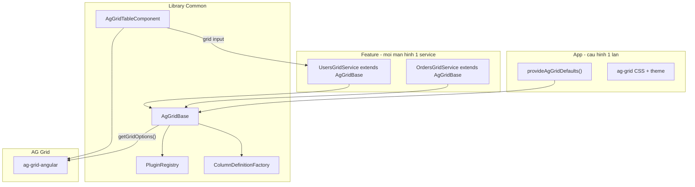
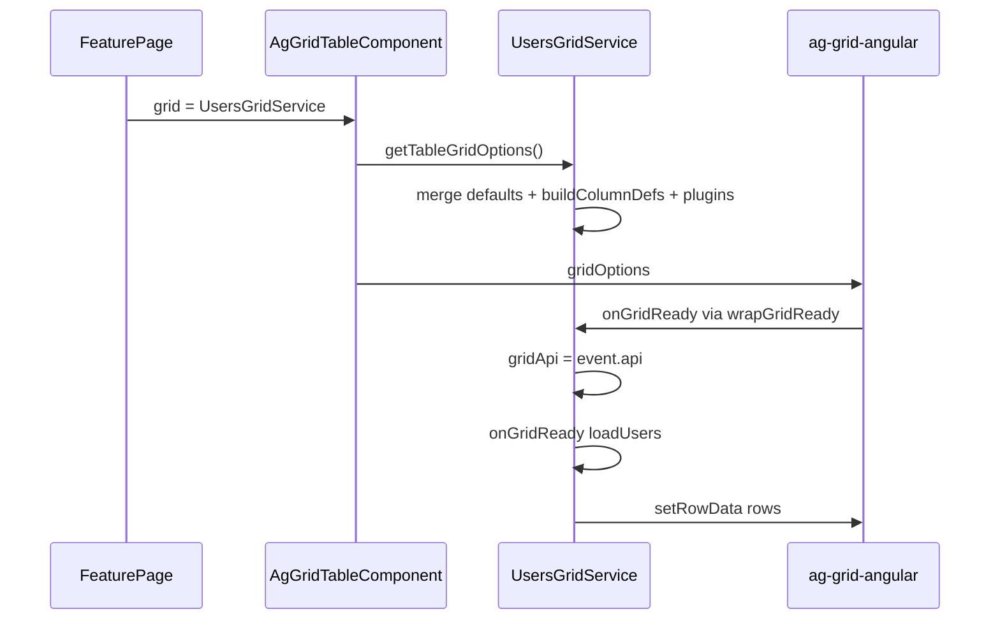

# Kế hoạch ý tưởng: Common AG Grid cho Angular 20

Tài liệu này mô tả **ý tưởng thiết kế**, **kiến trúc** và **cách triển khai** lớp AG Grid dùng chung trong dự án Angular 20. Mã nguồn tương ứng nằm trong [`src/lib/`](../src/lib/).

---

## 1. Vấn đề cần giải quyết

Trong một ứng dụng Angular 20 có nhiều màn hình dùng bảng (Users, Orders, Products…), mỗi team/feature thường copy-paste:

- `gridOptions` gần giống nhau (sort, filter, pagination, theme)
- Logic lặp: `gridReady`, `setRowData`, export CSV, loading overlay
- Column defs viết tay nhiều lần

**Hệ quả:** khó bảo trì, style không đồng nhất, sửa một chỗ phải sửa nhiều file.

**Mục tiêu common:** một **lớp cơ sở** + **component shell** + **factory/builder** để mỗi feature chỉ khai báo phần **riêng** (cột, API load data, hành vi đặc thù).

---

## 2. Kiến trúc tổng quan (3 tầng)



| Tầng | Trách nhiệm | Không làm |
|------|-------------|-----------|
| **App** | Theme, defaultColDef, chiều cao mặc định | Logic từng bảng |
| **Common** | Merge config, lifecycle, API wrapper, UI shell | Gọi HTTP cụ thể |
| **Feature** | Cột, load data, nút Refresh/Delete | Render `ag-grid-angular` trực tiếp |

---

## 3. Thành phần chính

### 3.1 `AgGridBase` — trái tim của common

**File:** [`src/lib/core/ag-grid-base.ts`](../src/lib/core/ag-grid-base.ts)

**Vai trò:** abstract class — mỗi bảng = **một service** `extends AgGridBase<RowType>`.

**Luồng merge cấu hình** (ưu tiên từ thấp → cao):

1. `provideAgGridDefaults()` — toàn app
2. `getDefaultGridOptions()` — override trong subclass (feature)
3. `super({ gridOptions, columnDefs, ... })` — constructor
4. `buildColumnDefs()` — cột do feature định nghĩa
5. `PluginRegistry.applyAll()` — plugin gắn thêm
6. (Server-side) `createServerSideDatasource()` — nếu override, bật `rowModelType: 'serverSide'`

**API công khai** feature dùng trực tiếp:

- `setRowData()`, `getSelectedRows()`, `exportCsv()`
- `showLoading()` / `hideLoading()`
- `setServerSideDatasource()`, `refreshServerSide()` — bảng server-side
- `requireApi()` — khi cần gọi AG Grid API sâu hơn

**Điểm mở rộng (override):**

| Method | Khi nào override |
|--------|------------------|
| `buildColumnDefs()` | Mỗi bảng — **bắt buộc** trong thực tế |
| `getDefaultGridOptions()` | Selection mode, domLayout, callback đặc thù |
| `onGridReady()` | Gọi API load data lần đầu |
| `onDestroy()` | Hủy subscription, cleanup |
| `createServerSideDatasource()` | Bảng phân trang/filter phía server |

**Ví dụ thực tế:** [`projects/demo/src/app/users-grid.service.ts`](../projects/demo/src/app/users-grid.service.ts)

---

### 3.2 `ColumnDefinitionFactory` — cột dùng chung

**File:** [`src/lib/core/column-definition.factory.ts`](../src/lib/core/column-definition.factory.ts)

**Vai trò:** `this.columns.text()`, `.number()`, `.date()`, `.checkbox()`, `.actions()` — tránh lặp `ColDef` boilerplate.

**Cách dùng trong feature:**

```typescript
protected override buildColumnDefs(): ColDef<UserRow>[] {
  return [
    this.columns.text({ field: 'name', flex: 2 }),
    this.columns.date('createdAt'),
    this.columns.number('total'),
  ];
}
```

---

### 3.3 `GridConfigBuilder` — cấu hình fluent (tùy chọn)

**File:** [`src/lib/core/grid-config.builder.ts`](../src/lib/core/grid-config.builder.ts)

**Vai trò:** chain `.withPagination(20).withRowSelection(...).toConfig()` rồi `super(builder.toConfig())` — hữu ích khi config phức tạp hoặc tạo grid động.

---

### 3.4 `GridPlugin` + `PluginRegistry` — mở rộng không cần inheritance sâu

**File:** [`src/lib/core/grid-plugin.ts`](../src/lib/core/grid-plugin.ts)

**Vai trò:** thêm hành vi cross-cutting (ví dụ: luôn export tên file cố định, audit log khi grid ready) qua `this.use(plugin)` trong constructor — **không** phải sửa `AgGridBase`.

```typescript
this.use({
  name: 'audit',
  onGridReady(api) { /* log */ },
});
```

---

### 3.5 `provideAgGridDefaults` — chuẩn hóa toàn app

**Files:**

- [`src/lib/tokens/ag-grid-defaults.token.ts`](../src/lib/tokens/ag-grid-defaults.token.ts)
- [`src/lib/providers/provide-ag-grid.ts`](../src/lib/providers/provide-ag-grid.ts)

**Đăng ký một lần** trong `app.config.ts`:

```typescript
provideAgGridDefaults({
  themeClass: 'ag-theme-quartz',
  defaultHeight: '480px',
  gridOptions: { defaultColDef: { sortable: true, filter: true } },
}),
```

`AgGridBase` dùng `inject(AG_GRID_DEFAULTS, { optional: true })` — mọi grid tự nhận theme/defaults.

---

### 3.6 `AgGridTableComponent` — UI shell dùng chung

**File:** [`src/lib/components/ag-grid-table.component.ts`](../src/lib/components/ag-grid-table.component.ts)

**Vai trò:** bọc `ag-grid-angular`, nhận `[grid]` là service implement `AgGridTableHost`, tự gọi `destroy()` khi component hủy.

**Template feature (luôn giống nhau):**

```html
<app-ag-grid-table [grid]="usersGrid" height="500px" />
```

```typescript
readonly usersGrid = inject(UsersGridService);
```

**Lý do `AgGridTableHost`:** tránh lỗi TypeScript khi `UsersGridService` là `AgGridBase<UserRow>` nhưng input component cần type “mờ” hơn — host chỉ cần `getTableGridOptions()`, `destroy()`, `themeClass`, `defaultHeight`.

---

## 4. Luồng runtime (từ mở trang → có data)



1. Component khởi tạo → `getTableGridOptions()`
2. AG Grid fire `gridReady` → `handleGridReady()` → `onGridReady()` của feature
3. Feature gọi API → `setRowData()` (client-side) hoặc datasource `getRows` (server-side)
4. User rời trang → `ngOnDestroy` → `grid.destroy()`

---

## 5. Quy trình tạo common cho feature mới (checklist)

### Bước 1 — Định nghĩa row type

```typescript
export interface OrderRow extends Record<string, unknown> {
  id: string;
  orderNo: string;
  total: number;
}
```

(`extends Record<string, unknown>` giúp tương thích `RowData`.)

### Bước 2 — Tạo service extend `AgGridBase`

```typescript
@Injectable()
export class OrdersGridService extends AgGridBase<OrderRow> {
  private readonly api = inject(OrdersApi);

  constructor() {
    super({ id: 'orders-grid', paginationPageSize: 25 });
  }

  protected override buildColumnDefs() { /* columns */ }
  protected override onGridReady() { this.reload(); }
  reload() { /* api -> setRowData */ }
}
```

### Bước 3 — Dùng `AgGridTableComponent` trên page

### Bước 4 (tùy chọn)

Plugin / override `getDefaultGridOptions` / `GridConfigBuilder` / server-side datasource

**Tham khảo mẫu:** [`src/lib/examples/users-grid.service.example.ts`](../src/lib/examples/users-grid.service.example.ts)

---

## 6. Server-side row model (tùy chọn)

Khi dữ liệu lớn hoặc filter/sort/pagination do backend xử lý:

```typescript
@Injectable()
export class OrdersServerGridService extends AgGridBase<OrderRow> {
  private readonly api = inject(OrdersApi);

  protected override createServerSideDatasource(): IServerSideDatasource<OrderRow> {
    return {
      getRows: (params) => {
        this.api
          .query({
            start: params.request.startRow ?? 0,
            end: params.request.endRow ?? 100,
            sort: params.request.sortModel,
            filter: params.request.filterModel,
          })
          .subscribe({
            next: (res) =>
              params.success({ rowData: res.rows, rowCount: res.total }),
            error: () => params.fail(),
          });
      },
    };
  }

  protected override buildColumnDefs(): ColDef<OrderRow>[] {
    return [this.columns.text({ field: 'orderNo' })];
  }
}
```

`AgGridBase` tự gắn `rowModelType: 'serverSide'` khi `createServerSideDatasource()` trả về datasource khác `null`.

Sau khi grid ready, có thể gọi `refreshServerSide()` để tải lại.

---

## 7. Cấu trúc thư mục đề xuất khi nhúng vào app thật

```
your-angular-app/
├── src/app/
│   ├── app.config.ts          # provideAgGridDefaults + ModuleRegistry AG Grid
│   ├── shared/ag-grid/        # copy hoặc npm link library
│   └── features/
│       ├── users/
│       │   ├── users-grid.service.ts   # extends AgGridBase
│       │   └── users.page.ts           # <app-ag-grid-table [grid]="...">
│       └── orders/
│           ├── orders-grid.service.ts
│           └── orders.page.ts
```

**Repo này:** library ở [`src/lib/`](../src/lib/), demo tại [`projects/demo/`](../projects/demo/) — `npm start` → http://localhost:4200/

---

## 8. Nguyên tắc thiết kế (để common bền vững)

1. **Composition trước copy-paste:** logic chung trong `AgGridBase`, đặc thù trong subclass.
2. **Một bảng = một service:** dễ test, inject, tái sử dụng trên nhiều page.
3. **UI tách khỏi logic:** `AgGridTableComponent` không biết Users hay Orders.
4. **Type-safe từng feature:** generic `AgGridBase<OrderRow>`; component shell dùng `AgGridTableHost` type-erased.
5. **Plugin cho hành vi ngang:** tránh class `AgGridBase` phình to vô hạn.

---

## 9. Việc có thể bổ sung sau

| Tính năng | Gợi ý triển khai |
|-----------|------------------|
| Master/detail | Override `getDefaultGridOptions` + plugin |
| Cell renderer dùng chung | Đăng ký qua plugin hoặc `components` trong defaults |
| i18n locale AG Grid | Thêm vào `provideAgGridDefaults` |
| Publish npm nội bộ | `ng-packagr` → `dist/` ([`ng-package.json`](../ng-package.json)) |

---

## 10. API public (export)

Xem [`src/public-api.ts`](../src/public-api.ts) — import từ `@app/ag-grid-common` trong app.
